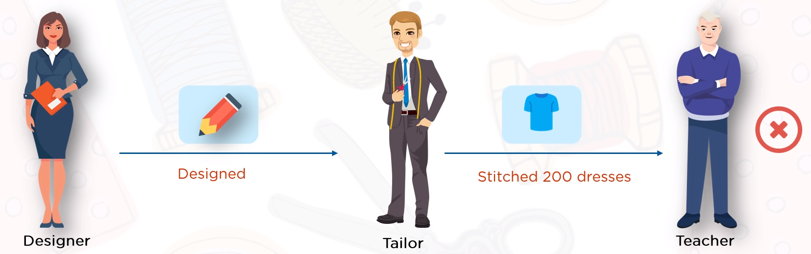
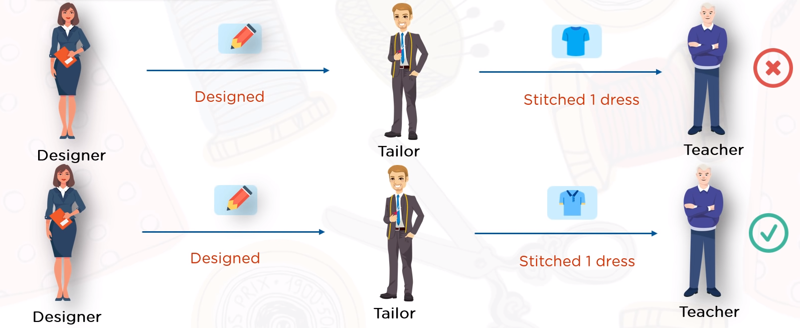
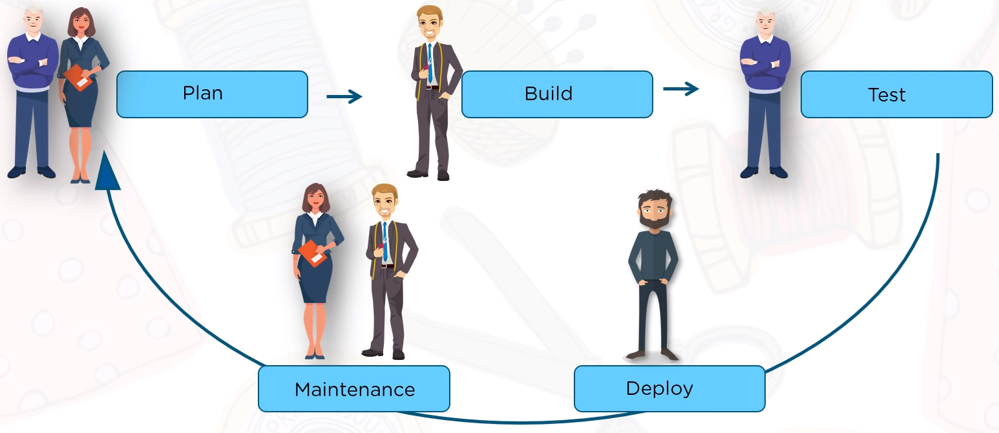
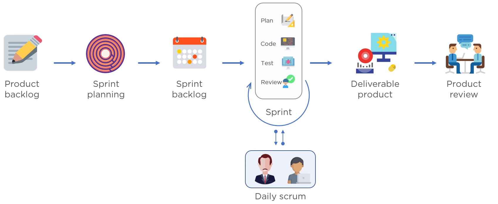
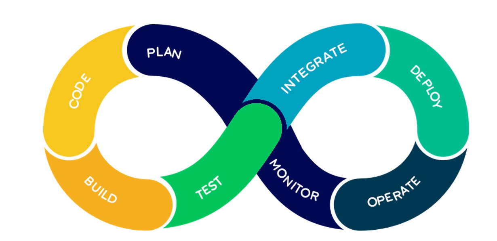

# Week 10

## [What is DevOps? | DevOps introduction | DevOps tools | DevOps tutorial for beginners | Simplilearn](https://youtu.be/CIK-pVOCV4E)

### Types of Software Development Models

The assignment is to produce 200 dresses that meet customer's expectations.

#### Waterfall

Have different groups of people separate from each other, passing output to the next group.

* The issue is that all of this completed without input from the person providing requirements, so that if the product is not up to specifications, the time it took to create and the product is wasted.

#### Agile

This shortens the working process to two-week sprints. Now there is more of a feedback loop that if a single product is bad, it can be corrected in the next sprint. Problem is that it still doesn't account for customer. Product can still not be right for the customer.

#### DevOps

Creates a testing and feedback step

* Typically have a tool like Jenkins to integrate all the different steps in DevOps methodology.
  * Plan & Code
  * Build
  * Test
  * Deploy
  * Monitor

##### DevOps Practices

* *Continuous integration*. Automatic compilation and testing is done on every code fetched from the repositories.
* *Continuous delivery*. Every integrated product is continuously integrated.
* *Microservices*. Applications are built of small independent services.
  * Office 365 goes through several changes a day on these small microservices. Allows for rapid development.
* *Monitoring and logging*. Continuous monitoring of the application metrics.
* *Infrastructure as code*. Codifying the configurations and policies.
* *Communication*. Efficient communication between all the teams in the pipeline.

##### Benefits of DevOps

* Reducing time of production, testing, and delivery
* Designing the simplest solutions to fit the requirements
* Achieving highest quality through continuous integration and delivery
* Automatic implementation of policy and configuration ensures security

## [Introduction to DevOps | DevOps tutorial for beginners | DevOps training for beginners | Simplilearn](https://youtu.be/Me3ea4nUt0U)

### Waterfall Model

Waterfall model is a traditional approach of software development.

* Development happens in a step by step manner.
  1. *Requirement and Analysis*. Programmers accept the client requirements and analyze it.
  2. *Design*. Programmers then come up with a project plan and a design architecture.
  3. *Development*. Programmers code the application as per project plan and design.
  4. *Testing*. Testing ensures the application is error-free and meets the requirements.
  5. *Maintenance*. After application is delivered, the operations team maintain the application.
* Disadvantages include:
  * Any new requirements from the client will restart the development cycle.
  * If client is unhappy with the product, the entire project cycle is restarted.
    * It is very expensive to make changes during the end of the product.

### Agile Model

Following the agile model, programmers create prototypes to understand client requirements.

* Client provides feedback and a list of changes to prototype.
* Creates a feedback loop that allows groups to quickly step through iterations of a product.

* Disadvantages include:
  * Product gets tested only on developer computers and not on production systems.
  * Developers and operations team work in silos.

### DevOps Model

An evolution from agile model of software development.

* It addresses the gap between development and operations team.
  * Development team will submit the application to the operations team for implementation.
  * Operations team will monitor the application and provide relevant feedback to developers.
* Phases of DevOps
  * Plan
    * Business owners and software development team discuss project goals and create a plan.
  * Code
    * Programmers design and code the application and use tools like Git to store application code.
  * Build
    * Build tools take code from different repositories and combine them to build the complete application.
  * Test
    * Tested using automation testing tools (i.e. Selenium and JUnit)
  * Integrate
    * New features are integrated automatically to the existing codebase
  * Deploy
    * Application is packaged after release and deployed from development server to production server
  * Operate
    * Operations team perform activities such as configuring servers and provisioning them with the required resources.
  * Monitor
    * Allows IT organizations to identify specific issues of specific releases and understand the impact on end-users

    

* Advantages include:
  * Releases more products and features within a short amount of time.
  * Complexity of maintaining an application is reduced.
  * Improved collaboration between developers and operations team.
  * Continuous integration and delivery ensure faster time to market.
