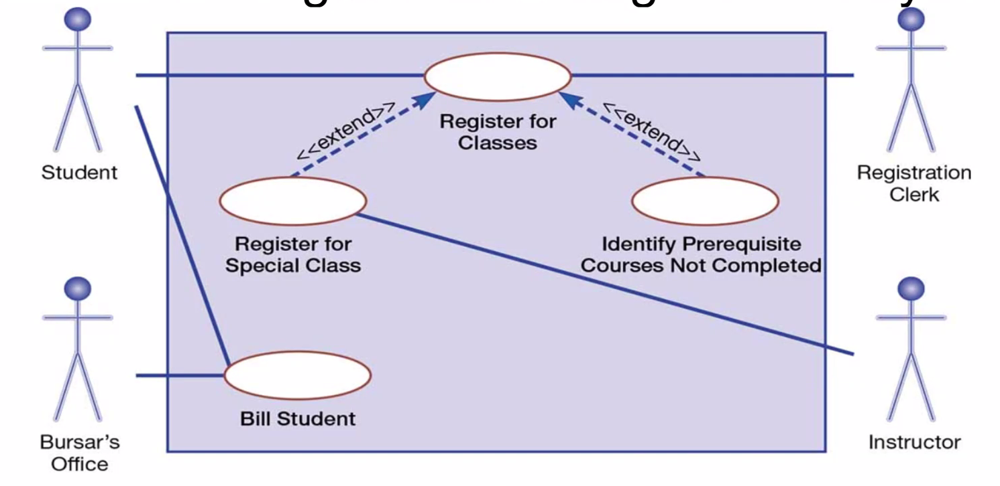

# Week 3

## Chapter 7A: Object-Oriented Analysis and Design: Use Cases

**use case**: a depiction of a system's behavior or functionality under various conditions as the system responds to request from users

**actors**: an external entity that interacts with a system

**use case diagram**: a picture showing system behavior, along with the key actors that interact with the system

Use cases are defined as subject-verb.

* Initiated by an actor
* Represents complete functionality

### Definition Symbols

* An actor is a role, not an individual.
* Use case is represented by an ellipsis.
* System boundary is represented as a box that includes all of the relevant use cases.
  * Actors are outside of the system boundary.
* Connections are an association between an actor and a use case. Represented by arrows.
* **extend relationship**: association between two use cases and where one adds new behaviors and actions to the other
* **include relationship**: an association between two use cases where one use case uses the functionality contained in the other

### Written Use Case

#### Level

**level**: perspective from a use case description is written, typically ranging from high level to extremely detailed

| Level | Description | Example Use Case |
| --- | --- | --- |
| White | As seen from the clouds | Buy parts to build cars. |
| Kite | You're still in the air, but more detail than a cloud level | Buy parts to build Escorts. |
| Blue | Known as sea level | Order Escort parts from suppliers. |
| Fish | Below sea level with a lot of detail | Choose supplier for a part. |
| Black | Bottom of the sea where the maximum amount of detail is provided | Establish a secure connection. |

#### Template Information

* **stakeholder**: people who have a vested interest in the system being developed
* **preconditions**: things that must be true before a use case can start (no outstanding debts)
* **minimal guarantee**: least amount promised to the stakeholder by a use case (rollback)
  * A way to determine this is to ask "What would make the stakeholder unhappy?"
* **success guarantee**: what must happen to effectively satisfy stakeholders
* **trigger**: event that initiates a use case (phone call or even another use case)
* **extension**: set of behaviors or functions in a use case that follow exceptions to the main success scenario (i.e. providing wrong user name or password)
  * The *else* statement that follows an *if* statement
