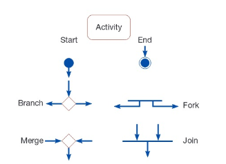
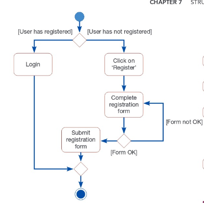
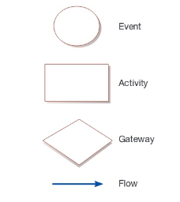
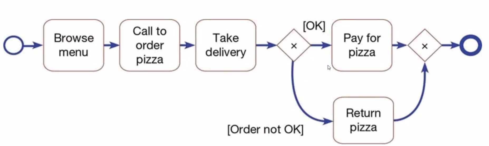
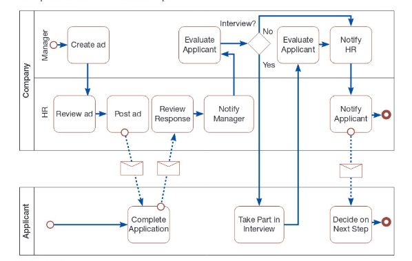

# Week 4

## Chapter 7B: Object-Oriented Analysis and Design: Activity Diagrams

**activity diagram**: shows the conditional logic for the sequence of system activities needed to accomplish a business process

* Used to depict the flow of control from activity to activity
* Help identify extensions in  use case
* Designed to show conditional logic
* branch = denotes a choice (diamond)
* merge = the point at which possible actions join together  (diamond)
* fork = where parallel activities stem from
* join = two processes joining together, independent streams coming 

Below is a basic activity diagram:

## Chapter 7C: Business Process Modeling

**business process**: a standard method for accomplishing a particular task necessary for an organization to function

Components of a business process model include:

* **event**: a trigger that initiates the start of a process
* **activity**: an action that must take place for process to be completed
* **gateway**: a decision point
* **flow**: the sequence of action in a process

**swimlane**: a way to visually encapsulate a process

* can be depicted either vertically or vertically.
* Whether a swimlane is used the diagram shows only once process with one actor.

**pool**: a way to encapsulate a process that has two or more participants

