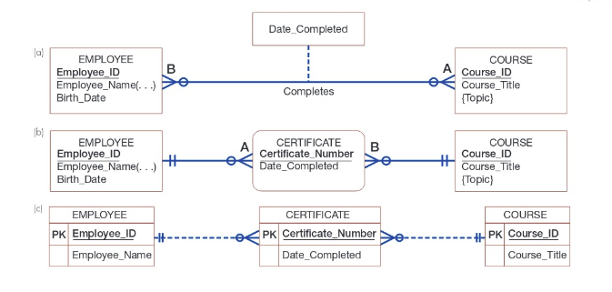
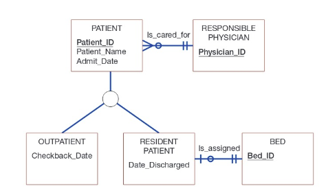
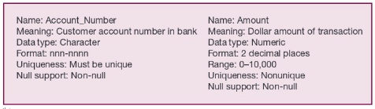
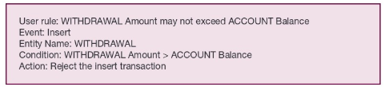
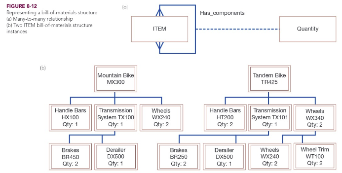
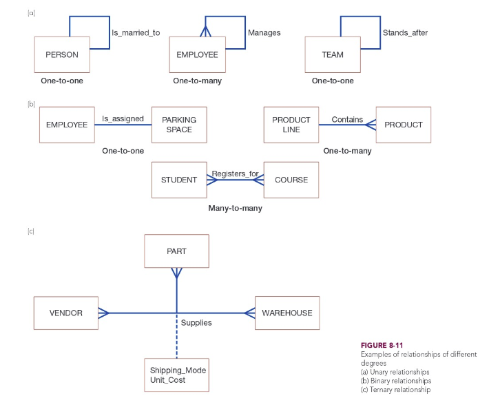

# Week 5

## Chapter 8: Structuring System Data Requirements

Previous techniques show how, where, and when data is used or changed in an information system, but not the definition, structure, and relationships between data.

**conceptual data model**: a detailed model that captures the overall structure of organizational data and is independent of any database management system or other implementation considerations

* Primary deliverables from a conceptual data model is an entity relationship (E-R) diagram.
  * Expressed in terms of:
    * Entities in the business environment
    * Relationships among those entities
    * The attributes (properties) of both the entities and their relationships

### Requirements Determination Questions for Data Modeling

1. What are the subjects/objects of the business?
   * Data entities and their descriptions
2. What unique characteristic (or characteristics) distinguishes each object from other objects of the same type?
   * The use of a primary key
3. What characteristics describe each object?
   * Refers to attributes and secondary keys
4. How do we use the data?
   * Security controls and understanding who really knows the meaning of data
5. Over what period of time are you interested in these data?
   * Cardinality and time dimensions of data
6. Are all instances of each object the same?
   * Are some objects summaries or combinations of more detailed objects?
   * Supertypes, subtypes, and aggregations
7. What events occur that imply associations among various objects?
   * Relationships and their cardinality and degree
8. Is each activity or event always handled the same way or are there special circumstances?
   * Integrity rules, minimum and maximum cardinality, time dimensions of data

The basic E-R modeling notation uses three main constructs: data entities, relationships and their associated attributes.

### Components of E-R Model

#### Entities

**entity**: person, place, object, event, or concept in the user environment about which the organization wishes to maintain data

**entity type**: a collection of entities that share common properties of characteristics

**entity instance**: a single occurrence of an entity type

Naming conventions include:

* Entity type name is a *singular noun* (i.e. CUSTOMER, STUDENT, AUTOMOBILE)
* Should be descriptive and specific to the organization
* Concise (i.e. REGISTRATION instead of STUDENT REGISTRATION FOR CLASS)
* *Event entity types* should be named for the *result of the event* not the activity or process of the event. (i.e. assigning an employee to work on an project results in an ASSIGNMENT)

#### Attribute

**attribute**: named property or a characteristic of an entity that is of interest to the organization

* Is a noun and should be unique (Age, Customer_ID)
* Follow a standard format (Student_GPA vs. GPA_of_Student)
* Similar attributes of different attributes of different types should use similar but distinguishing names (Faculty_Residence_City_Name, Student_Residence_City_Name)

**candidate key**: an attribute (or combination of attributes) that uniquely identifies each instance of an entity type (STUDENT- Student_ID)

**identifier**: a candidate key that has been selected as the unique identifying characteristic for an entity type

* Will not change its value over the life of each instance of the entity type
* Will never be null

**multivalued attribute**: attribute that may take on more than one value for each entity instance (i.e. an employee may know more than one language)

**repeating group**: a set of two or more multivalued attributes that are logically related (i.e an employee can have multiple dependents)

**required attribute**: an attribute that must have a value for every entity instance

**optional attribute**: an attribute that may have a value for every entity instance

**composite attribute**: an attribute that has meaningful component parts (i.e. name, address)

**derived attribute**: an attribute whose value can be computed from related attribute values (i.e. employee age can be derived from today's date and date of birth)

#### Relationship

**relationship**: an association between the instance of one or more entity types that is of interest to the organization

* Verb phrase (i.e. Assigned_to, Supplies, Teaches)
* Avoid using vagues names.
* Important to state who or what does the action, but not to explain how the action is taken.

#### Associative Entities

**associative entity**: an entity type that associates the instances of one or more entity types and contains attributes that are peculiar to the relationship between those entity instances, also called a *gerund*

* The attribute Date_Completed is is a property of the relationship between EMPLOYEE and COURSE, not either one individually.
  * (a) represents an attribute on a relationship
  * (b) represents an associative entity (CERTIFICATE)
    * Does not represent two binary relationships, so they do not have labels.
  * (c) associative entry modeled in Microsoft Visio

      

* A relationship must be turned into an associative entity is when the associative entity has other relationships with entities besides the relationship that caused its creation.

   

#### Supertypes and Subtypes

**subtype**: a subgrouping of the entities to an entity type that is meaningful to the organization and that shares common attributes or relationships distinct from other subgroupings

* STUDENT -> GRADUATE STUDENT, UNDERGRADUATE STUDENT

**supertype**: a generic entity type that has a relationship with one or more subtypes

PATIENT is a supertype, while OUTPATIENT and RESIDENT PATIENT are subtypes.

**total specialization rule**: specifies that each entity instance of the supertype must be a member of some subtype of the relationship

**partial specialization rule**: specifies than an entity instance of the supertype does not have to below to any subtype

**disjoint rule**: specifies that if an entity instance of the supertype is a member of one subtype, it cannot simultaneously me a member of any other subtype

**overlap rule**: specifies that an entity instance can simultaneously be a member of two (or more) subtypes

Examples of rules below:

* A PERSON must be (total specialization) an EMPLOYEE, an ALUMNUS, or a STUDENT, or any combination of these subtypes (overlap)
* An EMPLOYEE must be a FACULTY or a STAFF (disjoint), or may just be an EMPLOYEE (partial specialization)
* a STUDENT can only be a GRADUATE STUDENT or an UNDERGRADUATE STUDENT and nothing else (total specialization and disjoint)

#### Business Rules

**business rules**: specifications that preserve the integrity of the logical data model

* Four basic types of business rules are:
  * *Entity integrity*. Each instance of an entity type must have a unique identifier that is not null.
  * *Referential integrity constraints*. Rules concerning the relationships between entity types.
  * *Domains*. Constraints on valid values for attributes.
  * *Triggering operations*. Other business rules that protect the validity of attribute values.
* Generally captured during requirements determination.

**domain**: the set of all data types and values that an attribute can assume

* Offers several advantages:
  * Verify that the values for an attribute are valid.
  * Ensure that various data manipulation operations (such as joins or unions in a relational database system) are logical.
  * Help conserve effort in describing attribute characteristics.
* Below are domain definitions for a banking relationship ACCOUNT performs a WITHDRAWAL.

   

**triggering operation (trigger)**: an assertion or rule that governs the validity of data manipulation operations such as insert, update, and delete

* Usually includes the following:
  * *User rule*. A concise statement of the business rule to be enforced by the triggering operation.
  * *Event*. The data manipulation object (insert, delete, or update) that initiates the operation.
  * *Entity name*. The name of the entity being accessed and/or modified.
  * *Condition*. The condition that causes the operation to be triggered.
  * *Action*. The action taken when the operation is triggered.
* Important component of database strategy because it enables the responsibility for data integrity within the scope of the database management system and not application programs or human operators.

   

### Conceptual Data Modeling and the E-R Model

**degree**: the number of entity types that participate in a relationship

* The three most common relationships are:
  * unary (degree one) - a relationship between instances of one entity type, also called recursive relationship
    * A common unary relationship is a *bill-of-materials structure*, where manufactured products are made of subassemblies which are composed of other subassemblies/parts and so on. Represented by a man-to-many unary relationship.

   

  * binary (degree two) - a relationship between instances of two entity types, most common encountered in data modeling
  * ternary (degree three) - a simultaneous relationship among instances of three entity types
    * Not the same as three binary relationships. As seen in the example below *Shipping_Mode* is the type of shipping carrier used for a particular PART from a particular VENDOR to a particular WAREHOUSE.

**cardinality**: the number of instances of entity B that can (or must) be associated with each instance of entity A

* Minimum and maximum cardinality represent the minimum and maximum number of instances of entity B that may be associated with an instance of entity A.
  * If minimum is zero, it is an *optional* participant. More than one, *mandatory* participant.
  * There may be a specific number for the maximum cardinality. That can be represented by placing the number above or below the crow's foot.

## Video: Entity Relationship Modeling

The process of developing a database system consists of 3 stages:

1. Requirements Stage
   * Interviews and observation
   * Create a data model to represent what is needed
   * Content, relationships, and constraints of the data
2. Design Stage
   * Data model turned into database design
   * Name tables and attributes and properties
   * Including data constraints such as limits on data values, integrity constraints, and business rules
3. Implementation Stage
   * Construct database and fill it with objects (data, forms, reports)
   * Users trained, write documentation, install system

### Requirements Stage

#### Interviews and Observations

* Best to interview the perspective users of the database system and those that will administer the database system.
* Collect existing forms, reports, and queries during these interviews.
  * Ask if there are any needed changes to these documents.
* Good to create use cases of the system.
* Collect the business rules that may constrain how the database will be used.

#### Create the ER Model

**entity relationship (ER) model**: data model created in the requirements stage

* Important elements of an ER model include:
  * entities
  * attributes
  * identifiers
  * relationships
