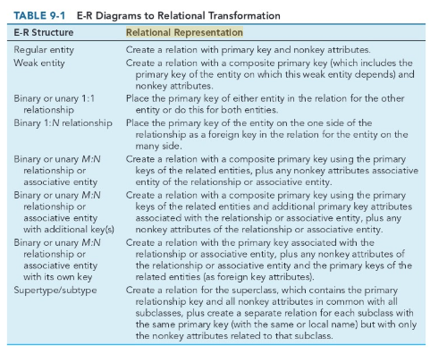

# Week 6

## Chapter 9: Designing Databases

### Database Design

#### The Process of Database Design

Four steps in logical database modeling and design:

1. Develop a logical data model for each known user interface for the application using normalization principles.
2. *View integration*. Combine normalized data requirements from all user interfaces into one consolidated logical database model.
3. Translate the conceptual E-R data model for the application or enterprise, developed without explicit consideration of specific user interfaces, into normalized data requirements.
4. Compare the consolidated logical database design with the translated E-R model and produce, through view integration, one final logical database model for the application.

Inputs allow you to make key physical database decisions including the following:

* Choosing a storage format (i.e. *data type*) for each attribute from the logical database model
* Grouping attributes from the logical database model into physical records (i.e. selecting a stored record or data structure)
* Arranging related records in secondary memory (hard disks and magnetic tapes) so that individual records and groups of records to be stored, retrieved and updated rapidly (file organization)
* Selecting media and structures for storing data to make access more efficient.

#### Deliverable and Outcomes

During logical database design you must account for every data element on a system input or output.

* Each relation (table with rows/columns) must be named and its attributes (columns) listed within parentheses.
* Must have *primary key*, an attribute (or combination of attributes) whose value is unique across all occurrences of a relation
  * Represented by an underline
  * Attribute that is the primary key of another relation is indicated by a dashed underline

#### The Relational Database Model

**relational database model**: data represented as a set of related tables or relations

**relation**: a named, two-dimensional table of data. Each relation consists of a set of named columns and an arbitrary number of unnamed rows.

* Not all tables are relations. Properties that distinguish them from nonrelational tables include:
  * Entries in cells are simple. An entry at the intersection of each row and column has a single value.
  * Entries in a given column are from the same set of values.
  * Each row is unique. Guaranteed by the relation having non-empty primary key value.
  * The sequence of columns can be interchanged without changing the meaning or the use of the relation.
  * The rows may be interchanged or stored in any sequences.

**well-structure relation**: a relation that contains a minimum amount of redundancy and that allows users to insert, modify, and delete the rows without errors or inconsistencies

* also known as a table

### Normalization

**normalization**: the process of converting complex data structures into simple, stable data structures

* The result of normalization is that every nonprimary key attribute depends the whole primary key and nothing but the primary key.

**functional dependency**: a constraint between two attributes in which the value of one attribute is determined by the value of another attribute

* If B is functionally dependent on A, there can only be one value of B for each value of A.
  * For a given Emp_ID, there can only be one Name associated with it.
* Can be functionally dependent on two (or more) attributes rather than just a single.

**second normal form (2NF)**: a relation is in second normal form if every nonprimary key attribute is functionally dependent on the whole primary key

**third normal form (3NF)**: a relation is in third normal form and has no functional (transitive) dependencies between two (or more) nonprimary key attributes

**foreign key**: an attribute that appears as a nonprimary key attribute in one relation and as a primary key attribute (or part of a primary key) in another relation

* denoted using a dashed underline
* Must satisfy *referential integrity*

**referential integrity**: a rule that states that either each foreign key value must match a primary key value in another relation or the foreign key value must be null (i.e. have no value)

### Transforming E-R Diagrams into Relations

The steps to transform an E-R diagram into normalized relations are:

1. Represent entities.
   * Each entity type becomes a relation.
   * Identifier of the entity type becomes the primary key.
   * Other attributes of the entity type become nonprimary keys of the relation.
2. Represent relationships.
   * Can be represented by making the primary key of one relation a foreign key of another relation.
   * **recursive foreign key**: a foreign key in a relation that references the primary key values of that same relation
     * i.e. Manager_ID references Emp_ID

      

3. Normalize the relations.
   * May have unnecessary redundancy and must be normalized to make them well-structured.
4. Merge the relations.
   * Some relations may be redundant (refer to the same entities). Merge the relations to remove the redundancy.
   * **synonym**: two different names that are used for the same attribute
     * * Emp_ID and Employee_Number may be synonyms
     * When merging relations that contain synonyms, you should obtain agreement, if possible, on single standardized name and eliminate the other synonym.
   * **homonym**: a single attribute that is used for two or more different attributes
       * Term account could be used for a checking account, savings account, loan account at a bank
       * Typically create new attributes that are more specific when merging.

### Physical File and Database Design

What one looks for in physical design:

* Normalized relations, including volume estimates
* Definitions of each attribute
* Descriptions of where and when data re used: entered, retrieved, deleted, and updated
* Expectations or requirements for response time and data integrity
* Descriptions of the technologies used for implementing the files and database - range of required decisions

**field**: the smallest unit of named application data recognized by system software

**data type**: a coding scheme recognized by system software for representing organizational data

* The four main objectives when selecting a data type are:
  * Minimize storage space
  * Represent all values of the field
  * Improve data integrity of the field
  * Support all data manipulations desired on the field
* **calculated field**: a field that can be derived from other database fields

#### Controlling Data Integrity

The four popular data integrity control methods are:

* *Default value*. A value a field will assume unless an explicit value is entered for that field.
  * i.e. assigning a city and state attributes to be the same as the store's city and state.
* *Range control*.
  * i.e. setting a lower bound of 0 or only allow the values JAN, FEB, MAR, etc.
* *Referential integrity*.
  * If Customer_ID was used in the CUSTOMER and CUST_ORDER relation, you want to make sure that the Customer_ID within CUST_ORDER is limited to the set in CUSTOMER. You don't want an order coming from a nonexistent or unknown customer.
* *Null value control*.
  * **null value**: a special field value, distinct from zero, blank, or any other value, that indicates that the value for the field is missing or otherwise unknown

**physical table**: a named set of rows and columns that specifies the fields in each row of the table

* may or may not correspond to one relation
* Goals of the design of a physical table is:
  * Efficient use of secondary storage
  * Data processing speed
    * **denormalization**: the process of splitting or combining normalized relations into physical tables based on affinity of use of rows and fields

**physical file**: a named set of table rows stored in a contiguous section of secondary memory

**file organization**: a technique for physically arranging the records of a file

**pointer**: a field of data that can be used to locate a related field or row of data

The basic families of file organizations include:

* **sequential file organization**: a file organization in which rows in a file are stored in sequence according to a primary key value
* **indexed file organization**: a file organization in which rows are stored either sequentially or nonsequentially, and an index is created that allows software to locate individual rows
  * **index**: a table used to determine the location of rows in a file that satisfy some condition
  * **secondary key**: one or a combination of fields for which more than one row may have the same combination of values
    * Allows the ability to create multiple indexes very quickly.
* **hashed file organization**: a file organization in which the address of each row is determined using an algorithm

#### Designing Controls for Files

* Two of the goals of physical table design is protection from failures or data loss and security from unauthorized use.
* There are multiple techniques for file restoration, including:
  * periodically making a backup copy of each file
  * storing a copy of each change to a file in a transaction log or audit trail
  * storing a copy of each row before or after is changed
* Can build security by:
  * Coding, or encrypting, the data in a file so it can't be read unless reader knows how to decrypt values
  * Require data file users to identify themselves with user name/password and only allowing certain CRUD activities
  * Prohibit users from directly manipulating any data but force programs and users to work with a copy (real or virtual)

## Video - [Database Programming Tutorial: Defining Table Relationships](https://youtu.be/V5DyvUfsboA)

## Video - [How to Work With Relationships in SQL Server](https://youtu.be/4q-keGvUnag)

## Video - [Relational Database Concepts](https://youtu.be/NvrpuBAMddw)
