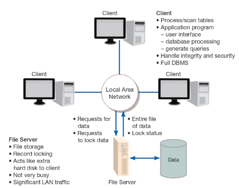
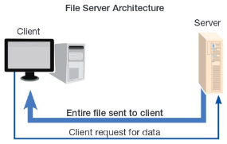
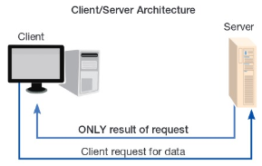
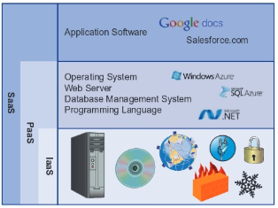
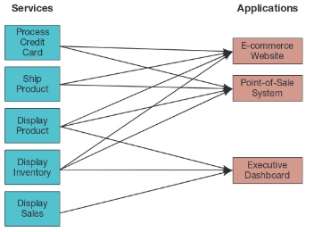
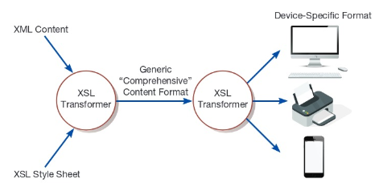

# Week 7

## Chapter 12: Designing Distributed and Internet Systems

## Designing LAN and Client/Server Systems

### Designing Systems for LANs

**local area network (LAN)**: the cabling, hardware, and software used to connect workstations, computers, and file servers located in a confined geographical area (typically within one building or campus)

* Typically within a few hundred feet of another with a total cable length of less than a mile
* Data manipulation occurs at the workstations

**file server**: a device that manages file operations and is shared by each client PC attached to a LAN

* Primary limits when using file servers on LANs:
  * Excessive data movement
    * Entire file is usually retrieved from server across the network.
  * The need for a powerful client workstation
    * Processing occurred on workstations and not the file server.
  * Decentralized data control
* When using a DBMS in a file server environment:
  * Each client is authorized to use the DBMS application program on the PC
  * One database on the file server and concurrently running copies of it on each active PC client

### Designing Systems for a Client/Server Architecture

**client/server architecture**: a LAN-based computing environment in which a central database server or engine performs all database commands sent to it from client workstations, and application programs on each client concentrate on user interface functions

* Application is divided (not necessarily evenly) between client and server

    

* **database engine**: the (back-end) portion of the client/server database system running on the server that provides database processing and shared access functions
* **client**: the (front-end) portion of the client/server database system that provides the user interface and data manipulation functions
* Benefits include:
  * By bringing processing to be performed to the source of processed data, brings improvement in response times and reduces network traffic
  * Facilitates the use of GUIs and visual representation techniques commonly available for workstations
  * Decoupling the client environment from the server environment
    * **application program interface (API)**: software building blocks that are used to ensure that common system capabilities, such as user interfaces and printing, as well as modules are standardized to facilitate data exchange between clients and servers
  * The three general components of any information system include
    * *Data management*. Functions that manage all interaction between software and files and databases (CRUD, security, concurrency control, and recovery).
    * *Data presentation*. Functions that manage just the interface between system users and the software (display and printing of forms and reports and possibly validating system inputs).
    * *Data analysis*. Functions that transform inputs into outputs (simple summarization to complex mathematical modeling such as regression analysis).
  * **application server**: a computing server where data analysis functions primarily reside
  * **virtual machine**: a software emulation of a physical computer system, both hardware and operating system, that allow more efficient sharing of physical hardware resources
    * **virtualization**: the act of creating virtual versions of a variety of computing capabilities including hardware platforms, operating systems, storage devices, and networks
  * **three-tiered client/server architecture**: advanced client/server architectures in which there are three logical and distinct applications - data management, presentation, and analysis - that are combined to create a single information system
    * Increasingly an *n-tiered architecture* is being used by organizations to develop more flexible and reusable applications
  * **middleware**: a combination of hardware, software, and communication technologies that brings data management, presentation, and analysis together into a three-tiered (or n-tiered) client/server architecture
    * Provides standard way to connect devices to applications and data by using standards, libraries, and APIs
  * **thin client**: a client device designed so that most processing and data storage occur on the server

#### Differences Between File Server and Client/Server Architectures

| Characteristic | File Server | Client/Server |
| --- | --- | --- |
| Processing | Client only | Both client and server |
| Concurrent Data Access | Low - managed by each client | High - managed by server |
| Network Usage | Large file and data transfers | Efficient data transfers |
| Database Security and Integrity | Low - managed by each client | High - managed by server |
| Software Maintenance | Low - software changes just on server | Mixed - some new parts must be delivered to each client |
| Hardware and System Software Flexibility | Client and server decoupled and can be mixed | Need for greater coordination between client and server |

### Cloud Computing

**information systems infrastructure**: the hardware, software, data, facilities, human resources, and services used by organizations to support their decision making, business processes, and competitive strategy

* There has been a shift away from developing and maintaining IS infrastructure toward thinking about what services the infrastructure should deliver
* Cloud computing is a form of the *utility computing* model
  * **utility computing**: a form of on-demand computing where resources in terms of processing, data storage, or networking are rented on an as-needed basis. The organization only pays for the services used.
  * AWS is a cloud computing provider

#### Cloud Characteristics

* On-demand self-service
  * Can access on an as-needed basis without the need for lengthy negotiations with the service provider
* Rapid elasticity
  * Can ramp up either up and down quickly
  * Don't need to order for an anticipated surge in demand (that may or may not come)
* Broad network access
  * Accessible from anywhere
* Resource pooling
* Measured service

#### Service Models

**infrastructure as a service (IaaS)**: a cloud computing model in which only the basic capabilities of processing, storage, and networking are provided

**platform as a service (PaaS)**: a cloud computing model in which the customer can run his or her own applications that are typically designed using tools provided by the service provider; the customer has limited or not control over the underlying infrastructure

**software as a service (SaaS)**: a cloud computing model in which a service provider offers applications via a cloud infrastructure

#### Managing Cloud Expectations

* Availability/Reliability
  * No one is immune from failures, no matter how big
  * Uptime, uptime, uptime!
* Scalability
  * Not all providers are created equal
* Viability
  * Will that organization stay in business over the time period computing is needed?
* Security, Privacy, and Compliance
  * Be cognizant of regulations like HIPAA, Sarbanes-Oxley Act, PCI
  * Less legal rights and control over data within a cloud than privately stored
* Diversity of offerings
* Openness
  * Am I locked in to this cloud provider or is easy to migrate if needed?
* Costs
  * Public vs. private? Can it be less costly internal?

### Service-Oriented Architecture

**service-oriented architecture (SOA)**: a software architecture in which business processes are broken down into individual components (or services) that are designed to achieve the desired results for the service consumer (which can either be an application, another service, or a person)

* The most common way to deploy a SOA is through the use of web services
  * **web service**: a method of communication between two electronic devices over a network
    * **eXtensible Markup Language (XML)**: an Internet authoring language that allows designers to create customized tags, enabling the definition, transmission, validation, and interpretation of data between applications.
    * **JavaScript Object Notation (JSON)**: a lightweight data interchange approach that is relatively easy for humans to understand and for computers to generate or interpret
    * The key technologies that are used to assist communication in a Web Services environment are:
      * **Simple Object Access Protocol (SOAP)**: a protocol for communicating XML data between web service applications and the operating system
      * **Representational State Transfer (REST)**: a relatively simple and fast protocol for communicating JSON data between Web service applications and the operating system

### Designing Internet Systems

Standards drive the Internet.

* **domain naming system (BIND)**: a method for translating Internet domain names into Internet Protocol (IP) addresses. BIND stands for Berkeley Internet Name Domain.
  * i.e. domain name www.coolwebsite.com translates to 123.132.23.55
* **Hypertext Transfer Protocol (HTTP)**: a communication protocol for exchanging information on the Internet
* **Hypertext Markup Language (HTML)**: the standard language for representing content on the Web through the use of hundreds of command tags
* **Cascading Style Sheets (CSSs)**: a set of style rules that tells a Web browser how to present a document
* **eXtensible Stylesheet Language (XSL)**: a specification for separating style from content when generating XML pages
  * More sophisticated method than CSS
  * Allows designers to separate presentation logic from site content
  * Standardizes look and feel

  

#### Design Issues Related to Site Management

* Customer Loyalty and Trustworthiness
  * Trustworthiness is conveyed in the following ways:
    * Design quality.
    * Up-front disclosure.
    * Comprehensive, correct, and current content.
    * Connected to the rest of the web.
  * **personalization**: providing Internet content to a user based upon knowledge of that customer
  * **customization**: Internet sites that allow users to customize the content and look of the site based on their personal preferences
* Links must liver forever.
  * Necessary for:
    * Customer bookmarks.
    * Links from other sites.
    * Search engine referrals.
    * Old content adds value.
  * Does not mean that Web content cannot change and evolve.
* System security
  * Distributed system, security, and ease of use are often in conflict with each other.
* Website content management
  * **content management system (CMS)**: a special type of software application for collecting, organizing, and publishing Website content
    * WordPress is a popular one.
