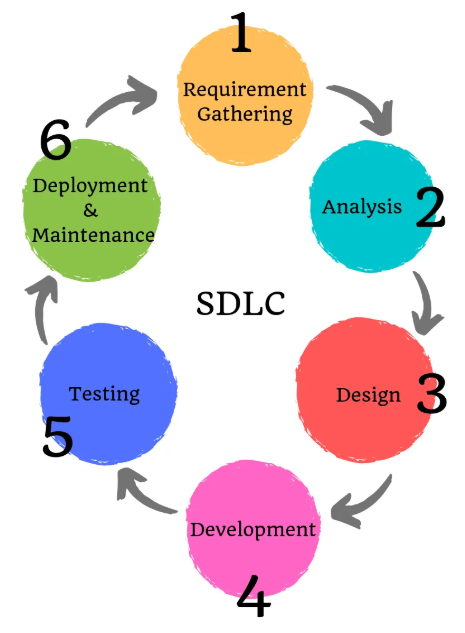

# Week 8

## [Types of Software Testing](https://www.softwaretestinghelp.com/types-of-software-testing)

**software testing**: a process of analyzing a software item to detect the differences between existing and required conditions (i.e., defects) and to evaluate the features of the software item

*Testing shows the presence of defects - goal is to make software fail.*

Testing approaches include:

* **white box**: based on applications internal code structure (glass box, clear box, structural testing)
  * Done at unit level
  * Internal perspective of the system and programming skills
* **black box**: evaluate the functionality of the software without looking at internal code (behavioral, specification-based, input-output)
* **grey box**: combination of white and black testing
  * Tester has access to design documents
  * Helps create better test cases

**unit testing**: checks individual modules of the source code to make sure properly working

* Typically done by programmers
* Requires detailed knowledge

**integration testing**: testing the connectivity or data transfer between a couple of unit tested modules

* Top-down approach, bottom-up approach, sandwich approach

### Software Testing Types

**alpha testing**: objective is to identify all possible issues or defects before releasing it to the market or to the user

* Most common type of testing in the software industry
* Carried out at the end of software development but before Beta Testing

**acceptance testing**: performed by the client and verifies whether the end to end the flow of the system is as per the business requirements or not and if it is as per the needs of the end-user

* Client accepts the software only when all the features and functionalities work as expected.
* Generally the last phase, also known as UAT

**ad-hoc testing**: objective is to find the defects and break the application by executing any flow of the application or any random functionality

* Informal and can be performed by anyone in the project

**accessibility testing**: determines whether the software or application is accessible for disabled people

**beta testing**: testing done by end-users or others in the *real environment*, the final testing done before releasing an application for commercial purpose

* End-user actually uses the software and shares the feedback to the company

**back-end testing**: testing of the database to validate data through queries

* Testing of table structure, schema, stored procedure, data structure and so on

**browser compatibility testing**: validates how web applications/sites perform on different browsers and operating systems

**backward compatibility testing**:  a type of testing that validates whether the newly developed or updated software works well with the older version of the environment

**boundary value testing**: checks the behavior of the application at the boundary level

* If an input takes a range of numbers from 1 to 500, one would perform tests for 0,1,2,499,500,501.

**branch testing**: code is tested thoroughly by traversing at every branch

**comparison testing**: comparison of a product's strength and weaknesses with its previous versions or other similar products

**compatibility testing**: validates how software behaves and run in a different environment, servers, hardware, and network environment

**component testing**: involves testing of multiple functionalities as a single code and its objective is to identify if any defect exists after connecting those multiple functionalities with each other

**end-to-end testing**: involves testing of a complete application environment in a situation that mimics real-world use

**equivalence partitioning**: testing technique that is a type of black box testing, that involves selecting a set of the group, picking a few values for testing with the understanding that all values from that group generate the same output

* Input accepts -10 to +10, so one would choose a negative value, zero, and a positive value

**example testing**: real-time scenarios based on the experience of the testers

**exploratory testing**: informal testing used to explore the application and look for defects that exist in the application

* Advisable to keep track of what flow you have tested and the activity you did before the start of the specific flow.

**functional testing**: Ignores the internal internal parts of a system and focuses only on the output to check if it is as per the requirement or not

**GUI testing**: validating the GUI as per the business requirement

* Can include the size of the buttons and input fields, alignment of all text, tables, and content in the tables, menu

**gorilla testing**: where one module or the functionality in the module is tested throughly and heavily to check the robustness of the application

**happy path testing**: the objective is to test an application successfully on a positive flow, ignoring negative or error conditions, to validate it generates expected product

**install/uninstall testing**: testing done on full, partial, or upgrade install/uninstall processes on different operating systems under different hardware or software environment

**load testing**: objective is to check how much load or maximum workload a system can handle without any performance degradation

* Helps find the maximum capacity of the system under specif load and any issues that cause software performance degradation.

**monkey testing**: testing with random input (as if a monkey with no knowledge would use it)

* Not necessary to be aware of the full functionality of the system

**mutation testing**: a type of white box testing in which the source code of one of the program is changed and verifies whether the existing test cases can identify these defects in the system

* Usually a very minimal change that does not impact the entire change

**negative testing**: testing with the mindset of "attitude to break", purposely entering incorrect data, invalid data, or input

* Validates that system throws an error of invalid input and behaves as expected.

**performance testing**: testing done check whether the system meets the performance requirements, also known as stress or load testing

**recovery testing**: validates how well the system recovers from crashes or disasters

* Determines if the system is able to continue the operation after a disaster (i.e. network loss or power failure)

**regression testing**: testing an application as a whole for the modification in any module or functionality

* usually done with automation testing tools

**risk-based testing (RBT)**: the functionalities or requirements are tested based on their priority

* Priority decision is based on business need.
* Usually carried out if there is insufficient time available to test entire software and software needs to be implemented on time without any delay.

**sanity testing**: testing done to determine if a new software version is performing well enough to accept it for a major testing effort or not

**security testing**: done to check how the software or application is secure from internal and external threats

* Includes how much software is secure from a malicious program, viruses, and how strong the authorization and authentication processes are

**smoke testing**: validates that no show stopper defect exists in the build which will prevent the testing team to from testing the application in detail

**static testing**: a type of testing done which is executed without executing on any code

* Involves reviews, walkthrough, and inspection of the deliverables of the project. Checks code syntax and naming conventions.

**stress testing**: testing done when a system is stressed beyond its specifications in order to check how and when it fails

**system testing**: the entire system is tested as per the requirements

**usability testing**: testing where user-friendliness is checked, to see if a new user can understand and navigate the application easily or not

**vulnerability testing**: testing that involves identifying weakness in the software, hardware, and the network, helps identify critical defects or flaws in the security

**volume testing**: testing where application undergoes a huge amount of data and checking of the behavior and response time

## Video: [Why Software Testing?](https://youtu.be/pcTS5I5kpEs)

Testing is important because, depending on the system, a bug or defect can be the difference between life and death or large revenue loss.

## Video: [What is Software Testing?](https://youtu.be/cDQ34z0oqnQ)

Testing is a phase of both the SDLC and waterfall development models.

* Two components of testing:
  * *Verification* means making sure that everything works and the system does what you expect.
  * *Validation* means matching the customer requirements in an efficient manner.
* The two primary types of testing are:
  * *Functional testing*. Testing the actual code with input/output.
  * *Nonfunctional testing*. Performance, speed, scalability, and load.

Software development life cycle (SDLC)

Waterfall model

