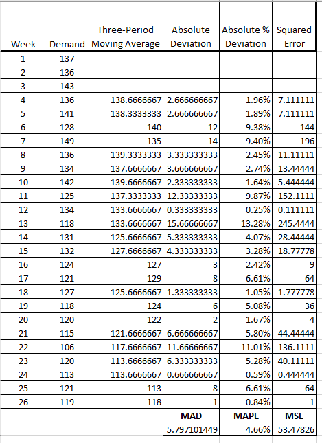
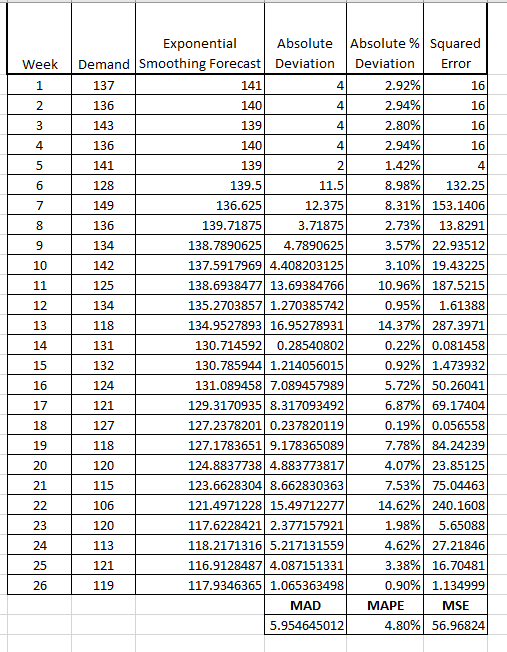

# Homework (Week 1)

## Chapter 1

### Problem 1-6

Normal Hours:

* 2500 uniforms per week
* Cost = $120 per uniform
* Contract Price = $200 per uniform
* 2 shifts, 40 hours per week
* First shift = 70 employees
* Second shift = 30 employees

Urgent Hours:

* 4000 uniforms per week
* Cost = $144 per uniform
* 2 shifts, 72 hours per week

a. 

Normal Multifactor productivity Ratio

Urgent Multifactor productivity Ratio

**Productivity ratio decreased by 16.8%.**

b.

Normal labor productivity

Urgent labor productivity

**Productivity ratio decreased by 11.1%.**

c.

Normal Production

Urgent Production

**Weekly profits increase by $24,000.**

### Problem 9

a.

Multifactor productivity

Labor productivity

### Case: Chad's Creative Concepts

1. For daily operations, Chad must figure out how to better share equipment and craftspeople for the custom-made and standard furniture. That is the problem that is most pressing. To better understand the operational strategy of how to address the operational problems currently happening in the plant, Chad must clearly state the corporate strategy. All things being being equal, it makes sense to prioritize the custom furniture because it has a higher profit margin. This may not be the most efficient way to handle manufacturing. Over the long run, Chad should decide what kind of company it is: standard or custom.
2. Sales and marketing increased the complexity for operations by adding standard pieces to the custom business. The new market segment had concerns relating to price and delivery, requiring operations to do things in a different manner.
3. A move to standard furnitures makes the financial structure of the company more stable. With standard furniture, you can count on standard costs for components and craftsmanship, and selling through retail you have a better idea of what sales will be. It is more variable with the custom furniture.

## Supplement A

### Problem A-6

a. To find the value, where it is most attractive you must set the equations equal to each other to find out where they intersect.

Manual

Computerized

Work

 

 

When the amount of clippings reaches **227,849**, the automated process becomes more attractive.

b. The computerized equation must be changed to reflect new price. Then calculate the results of the manual process at 225,000 and the computerized process at the increased volume of 1,125,000 clippings.

Manual

Computerized

The profit for manual is $5,000, while the profit for computerized $668,750. The clipping service should modernize.

c.

The computerized process would break even at **742,858 units** with the new price.

### Problem A-20

Management should build a large facility as it has the highest expected payoff.

## Chapter 8

### Problem 8-18

a. A three-period moving average

b. a three-period weighted moving average

c. Exponential smoothing

