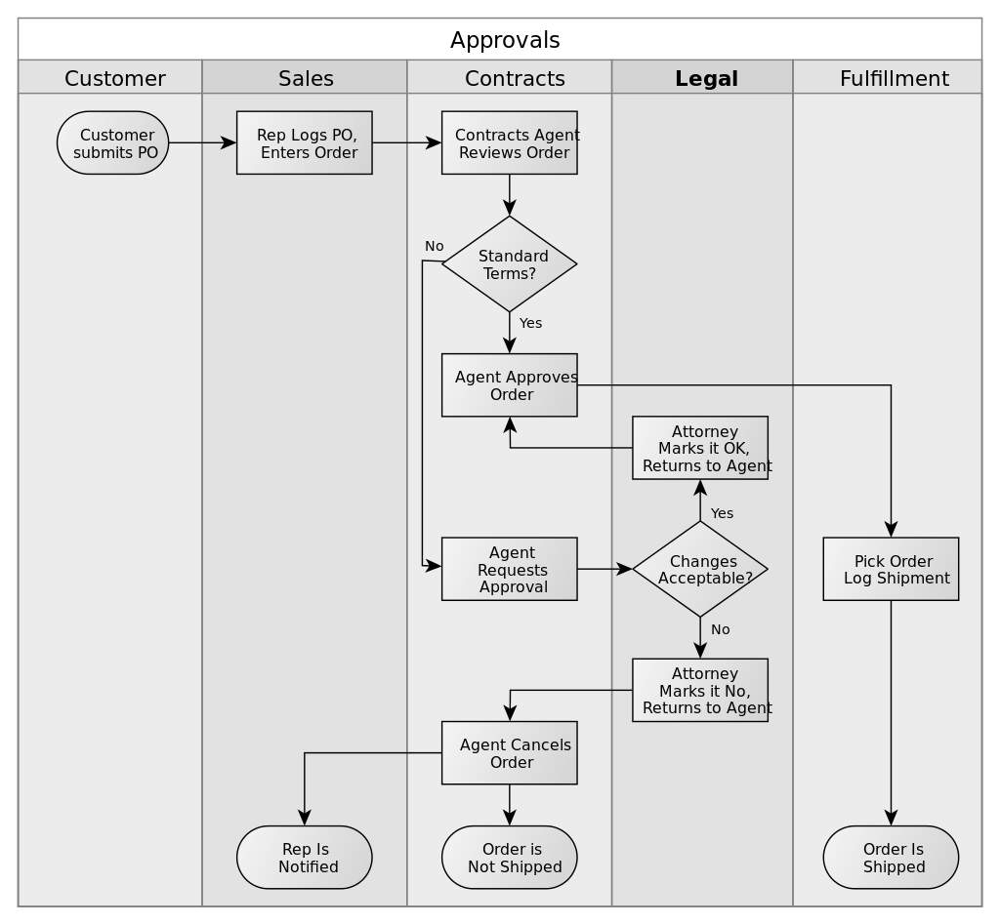
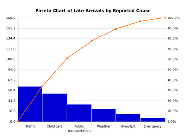

# Week 3

## Chapter 2: Process Strategy and Analysis

*Process analysis* is the documentation and detailed understanding of how work is performed and how it can be redesigned.

### Six Sigma Process Improvement Model

* Define.
  * Must establish the scope and boundaries of the process.
* Measure.
  * **metrics**: performance measures that are established for a process and the steps within it
  * Need measures to provide clues on how to improve a process.
* Analyze.
  * A careful analysis of metrics should uncover *disconnects* between actual and desired performance.
* Improve.
  * Using analytical and creative thinking, design teams generate a long list of ideas for improvement that are sifted and analyzed.
  * Document new process "as proposed".
  * Implement the changes.
* Control.
  * Monitor the process to make sure the high performance levels are maintained.

The levels of training in the Six sigma program include:

* Green Belt - achieved the first level of training in a Six Sigma program and spends part of their time teaching and helping teams with projects
* Black Belt - achieved the highest level of training in a Six Sigma program and spends all of their time teaching and leading teams involved in Six Sigma projects
* Master Black Belt - full-time teachers and mentors to several Black Belts

### Defining, Measuring, and Analyzing the Process

Three major techniques for effectively defining and measuring processes are flowcharts, work measurement techniques, and process charts.

#### Flowcharts

**flowchart**: a diagram that traces the flow of information, customers, equipment, or materials through the various steps of a process

**swim lane flowchart**: a visual representation that groups functional areas responsible for different subprocesses into lanes

* most appropriate when the business process spans several department boundaries
* Handoffs are points where cross-functional coordination is at a particular risk due to the silo mentality

**service blueprint**: a special flowchart of a service process that shows which steps have high customer contact

* uses a dotted line of visibility to identify which steps are visible to the customer and those that are not

#### Work Measurement Techniques

We need estimates of the average time for each step in a process for capacity planning, constraint management, performance appraisal, and scheduling.

Some work measurement methods include:

* **time study**: a method using a trained analyst to perform four basic steps in setting a time standard for a job or process
  * Those steps include:
    * Selecting the work element within the process to be studied
    * Timing the elements
    * Determining the sample size
    * Setting the final standard
  * The analyst then assigns a performance rating for each element to adjust for normal effort.
* **elemental standard data**: a database of standards compiled by a firm's analysts for basic elements that can draw on later to estimate the time required for a particular job
  * Most appropriate when products or services are highly customized, job processes prevail, and process divergence is great
* **predetermined data method**: a database approach that divides each work element into a series of micromotions that make up the element. The analyst then consults a published database that contains the normal times for the full array of possible micromotions.
  * Useful for highly repetitive processes with little process divergence and line flows
* **work sampling**: a process that estimates the proportion of time spent by people or machines on different activities, based on observations randomized over time
* learning curve analysis
  * **learning curve**: a line that displays the relationship between processing time and the cumulative quantity of the product or service produced
  * It typically decreases the more units or customers are processed.

#### Process Charts

**process chart**: an organized way of documenting all the activities performed by a person or group of people, at a workstation, with a customer, or on materials

* Unlike flowcharts, it requires the time estimates.
* The activities for typical process can be boiled down into five categories:
  * operation - changes, creates, or adds something
  * transportation - moves the study's subject from one place to another
  * inspection - checks or verifies something but does not change it
  * delay - occurs when the subject is held up awaiting further action
  * storage - occurs when something is put away until a later time

### Data Analysis Tools

**checklist**: a form used to record the frequency of occurrence of certain process failures

* A process failure is any performance shortfall, such as error, delay, environmental waste, rework, and the like.

**histogram**: a summarization of data measured on a continuous scale, showing the frequency distribution of some process failure

* In statistical terms, the central tendency and dispersion of the data.

**bar chart**: a series of bars representing the frequency of occurrence of data characteristics measured on a yes/no basis

**pareto chart**: a bar chart on which factors are plotted along the horizontal axis in decreasing order of frequency

**scatter diagram**: a plot of two variables showing whether they are related

**cause-and-effect diagram**: a diagram that relates a key performance problem to its potential causes

* also known as a fishbone diagram
  * Main performance gap is the *head*
  * The major categories of potential causes are *bones*
  * Likely specific causes are *ribs*

**graphs**: representations of data in a variety of pictorial forms, such as line charts and pie charts

**process simulation**: the act of reproducing the behavior of a process, using a model that describes each step

### Redesigning and Managing Process Improvements

#### Questions and Brainstormings

Ideas can be uncovered by asking the following questions about a process:

1. *What* is being done?
2. *When* is it being done?
3. *Who* is doing it?
4. *Where* is it being done?
5. *How* is it being done?
6. *How* well does it do on the various metrics of importance?

***These often lead to more questions.***

**brainstorming**: letting a group of people, knowledgeable about the process, propose ideas for change by saying whatever comes to mind

* typically discouraged from evaluating any of the ideas generated during the session to boost creativity
* After the brainstorming session, then an evaluation phase determine the best payoffs and viable ideas.

#### Benchmarking

**benchmarking**: a systematic procedure that measures a firm's processes, services, and products against those of industry leaders

* Competitive benchmarking is based on comparison with a direct industry competitor.
* Functional benchmarking compares areas such as administration, customer service, and sales operations with those of outstanding firms in any industry.
* Internal benchmarking involves using an organizational unit with superior performance as the benchmark for other units.

#### Implementing

Avoid the following seven mistakes when managing processes:

1. Not connecting with strategic issues.
2. Not involving the right people in the right way.
3. Not giving the design teams and process analysts a clear charter, and then holding them accountable.
4. Not being satisfied unless fundamental "reengineering" changes are made
   * Things should not just be limited to large changes, small ones have an effect too
5. Not considering the impact on people
6. Not giving attention to implementation
   * Only matters if the redesigned process is actually implemented.
7. Not creating an infrastructure for continuous process improvement
   * Is anyone checking if anticipated benefits of a redesigned process are actually being realized?

## Chapter 3: Quality and Performance

### Costs of Quality

**defect**: any instance when a process fails to satisfy its customer

* "Any that happened that should not have happened and that one does not want to happen again"

The costs of quality can be broken down into four categories:

* **prevention costs**: costs associated with preventing defects before they happen
  * Includes redesigning the process to remove the causes of poor performance, redesigning the service/product to make it simpler to produce, training employees in the process of continuous improvement
  * Investment in areas of product or service requirements, quality planning, quality assurance, and training
* **appraisal costs**: costs incurred when the firm assesses the performance level of its processes
  * Some examples include verification, quality audits, and supplier rating
* **internal failure costs**: costs resulting from defects that are discovered during the production of a service or product
  * Typically falls in to three main categories:
    * rework or rectification
    * scrap - incurred if a defective item is unfit for further processing and cannot be repaired, used or sold
    * Waste - involves performance of unnecessary work or holding stock as a result of errors or poor communication and organization
* **external failure costs**: costs that arise when a defect is discovered after the customer receives the service or product
  * Certainly erodes market share and profits because dissatisfied customers will talk about bad service to their friends, who in turn tell others.
  * Examples include repairs and servicing, complaints, returns, warranty service and litigation costs
  * **warranty**: a written guarantee that the producer will replace or repair defective parts or perform the service to the customer's satisfaction

