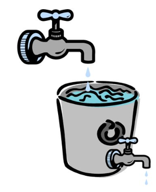
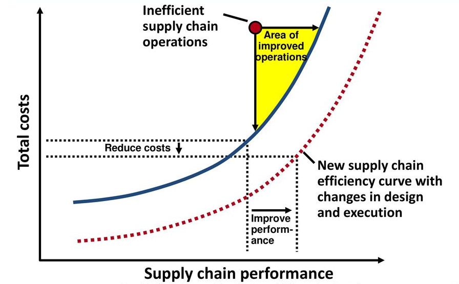

# Week 5

## Chapter 6: Lean Systems

**lean systems**: operations systems that maximize the value added by each of a company's activities by removing waste and delays from them

* Is important to a number of departments and functional areas across the organization:
  * Marketing relies on lean systems to deliver high-quality services or products on time and at reasonable prices
  * Human Resources must put in the right incentive system for a flexible workforce who can successfully operate a lean system
  * Engineering must design products that use use common parts, so that fewer setups and focused factories can be used
  * Operations must maintain close ties with suppliers, design the lean system and using it in the production of services or goods
  * Accounting must adjust its billing and cost accounting practices to provide the support needed to manage lean systems
  * Management must embrace the lean philosophy and make it a part of organizational culture and learning

### Continuous Improvement Using a Lean Systems Approach

**just-in-time (JIT) philosophy**: the belief that waste can be eliminated by cutting unnecessary capacity or inventory and removing nonvalue-added activities in operations

The eight types of waste (*muda*) include:

1. Overproduction - Manufacturing an item before it is needed, making it difficult to detect defects and creating excessive lead times and inventory.
2. Inappropriate processing - Using expensive high-precision equipment when simpler machines would suffice. Leads to overutilization of expensive capital assets.
3. Waiting - Unbalanced workstations make operators lose time, because if a process step takes longer than the next, then the operator will either stand idly waiting, or they will be performing their tasks at a speed that make it appear that they have work to complete.
4. Transportation - Excessive movement and material handling of product between processes, which can cause damage and deterioration of product quality without adding any significant customer value.
5. Motion - Unnecessary effort related to the ergonomics of bending, stretching, reaching, lifting, and walking. Jobs with excessive motion should be redesigned.
6. Inventory - Excess inventory hides problems on the shop floor, consumes space, increases lead times, and inhibits communication. Work-in-process inventory is a direct result of overproduction and waiting.
7. Defects - Quality defects result in a rework and scrap and add wasteful costs to the system in the form of lost capacity, rescheduling effort, increased inspection, and loss of customer good will.
8. Underutilization of employees - Failure of the firm to learn from and capitalize on its employees' knowledge and creativity impedes long-term efforts to eliminate waste.

**JIT system**: a system that organizes the resources, information flows, and decision rules that enable a firm to realize the benefits of JIT principles

* By spotlighting areas that need improvement, lean systems lead to continuous improvement in quality and productivity (kaizen).
  * Excess capacity or inventory hides underlying problems with the processes that produce a service or product.
  * A typical kaizen tactic is cut inventories/resources to expose problems at the plant/service operation, record, and later fix. Then the inventories/resources are cut permanently to that level.

### Strategic Characteristics of Lean Systems

#### Supply Chain Considerations in Lean Systems

Two salient characteristics of lean systems that are related to creating and managing material flows in a supply chain:

* *Close supplier ties*. Because lean systems operate with low levels of capacity slack or inventory, a close relationship with suppliers is a must.
  * Supplies must be shipped frequently, have short lead times, arrive on schedule, and be of high quality.
  * Works out for both parties:
    * Suppliers have more inventory planning and delivery scheduling, which improves profit margins
    * Customers can negotiate lower component prices.
  * This can't be done if suppliers are viewed as adversaries, but partners.
  * Easier to do if there are a smaller amount of suppliers and they are in close geographic proximity.
* *Small lot sizes*.
  * **lot**: a quantity of items that are processed together.
  * Benefits include:
    * Small lots have the advantage of reducing the average level of inventory relative to large lots.
    * They pass through the system faster than large lots since they do not keep materials waiting.
    * If any defects are found, large lots cause longer delays because the entire lot must be examined to find all the items that need rework.
  * Disadvantages include:
    * Smaller lots means increased setup frequency. Typically a setup takes the same time regardless of the size of the lot. This means that many small lots may result in waste of idle employees, equipment, and materials.
      * Must make setup times be very brief to be efficient.
      * **single-digit setup**: the goal of having a setup time of less than 10 minutes

#### Process Considerations in Lean Systems

* *Pull method of work flow*.
  * Managers have a choice as to the nature of material flows in a process or supply chain, namely:
    * **pull method**: a method in which customer demand activates production of the service or item
    * Most firms using lean operations use this method
    * **push method**: a method in which production of the item begins in advance of customer needs
    * The choice between push and pull methods is often situational. There is no one-size-fits-all.
* *Quality at the source*. Defects are caught and corrected where they are created.
  * **jidoka**: automatically stopping the process when something is wrong and then fixing the problems as the line itself as they occur
    * Represents a visual system whereby status of the system in terms of safety, quality, delivery, and cost performance relative to the goals for a given fabrication cell or workstation in an assembly line is clearly visible to workers on the floor at all times
    * The alternative is to push problems down the line to be resolved later, which is often ineffective.
  * **poka-yoke**: mistake-proofing methods aimed at designing fail-safe systems that minimize human error
  * **andon**: a system that gives machines and machine operators the ability to signal the occurrence of any abnormal conditions such as tool malfunction, shortage of parts, or the product being made outside the desired specifications
    * Can take the form of audio alarms, blinking lights, LCD text displays, or cords that can be pulled by workers to ask for help or stop the production line
* *Uniform workstation loads*.
  * For manufacturing can be achieved by assembling the same type and number of units each day.
  * **takt time**: cycle time needed to match the rate of production to the rate of sales or consumption
    * To produce 450 units in one shift of 480 minutes, the line must roll out a vehicle every ( 480/450 ) **1.067 minutes**.
  * **heijunka**: the leveling of production load by both volume and product mix
    * Does not build products to the actual flow of customer orders but levels out the volume of orders in a period so that the same amount and mix are being made ach day.
    * Two possible heijunka options include:
      * **mixed-model assembly**: a type of assembly that produces a mix of models in smaller lots
        * Find the ratio of products and assign it to smaller lots. If one needed to manufacture 200 Cs, 150 As, and 100 Hs, that can be reduce to many cycles of 4 Cs, 3 As, and 2 Hs.
      * Use a lot size of one and repeat the production schedule (i.e. C-H-C-A-C-A-C-H-A)
        * Only works if if the setup times are brief.
* *Standardized components and work methods*.
  * IN highly repetitive service operations, analyzing work methods and documenting improvements can gain great efficiencies.
* *Flexible workforce*.
  * A benefit of flexibility is the ability to shift workers between workstations to help relieve bottlenecks without the need for inventory buffers.
* *Automation*.
  * Benefits are greater profits, greater market share, or both because of the reduced costs.
  * More automation is not always good because humans can do some jobs better.
* *Five S practices*.
  * **Five S (SS)**: a methodology consisting of five workplace practices - sorting, straightening, shining, standardizing, and sustaining - that are conducive to visual controls and lean production
    * Sort: Separate needed items from unneeded items. Discard the unneeded.
    * Straighten: Neatly arrange what is left, with a place for everything and everything in its place.
    * Shine: Clean and wash the work area and make it shine.
    * Standardize: Establish schedules and methods of performing the cleaning and sorting.
    * Sustain: Create discipline to perform the first four S practices, whereby everyone understands, obeys, and practices the rules when in the plant. Implement mechanisms to sustain the gains by involving people and recognizing them through a performance measurement system.
* *Total productive maintenance*.
  * Also known as total preventive maintenance
  * Reduces the frequency and duration of machine downtime
  * While performing routine maintenance activities, test other machine parts that may need replaced. Cheaper to do than while dealing with a machine failure during production.

### Designing Lean System Layouts

Line flows are recommended in designing lean system layouts because the eliminate waste by reducing the frequency of setups.

**one-worker, multiple machines (OWMM) cell**: a one-person cell in which a worker operates several different machines simultaneously to achieve a line flow

**group technology (GT)**: an option for achieving line flow layouts with low volume processes; this technique creates cells not limited to just one worker and has a unique way of selecting work to be done by the cell

* Groups parts or products with similar characteristics into families and sets aside groups of machines for their production.
* Once grouped, organize machine tools to perform the basic processes on each cell.

### The Kanban System

**Kanban**: a Japanese word meaning "card" or "visible record" that refers to cards used to control the flow of production through a factory

General operating rules are as follows:

1. Each container must have a card.
2. The assembly line always withdraw materials from the fabrication cell. The fabrication cell never pushes parts to the assembly line because, sooner or later, parts will be supplied that are not yet needed for production.
3. Containers of parts must never be removed from a storage area without a Kanban first being posted on the receiving post.
4. The containers should always contain the same number of good parts. The use of nonstandard containers or irregularly filled containers disrupts the production flow of the assembly line.
5. Only nondefective parts should be passed along to the assembly line to make the best use of materials and worker's time (i.e. building quality at the source).
6. Total production should not exceed the total amount authorized on the Kanbans in the system.

WIP = work-in-process = (average demand rate)(average times a container spends in the manufacturing progress) + safety stock

* kappa = number of containers for a part
* d = expected daily demand for the part, in units
* omega = average waiting time during the production process plus materials handling time per container, in fractions of the day
* rho = average processing time per container, in fractions of a day
* c = quantity in a standard container of the part
* alpha = a policy variable that adds safety stock  to cover for unexpected circumstances (Toyota uses a value of no more than 10%)

Cards aren't the only way to signal the need for more production of a part.

* Container system where the container itself is the signal device.
  * An empty container signals the need to fill it.
  * Used for containers that are specifically designed for a particular part and no other parts could accidentally be put in the container.
* Containerless system
  * McDonald's has information entered by order taker transmitted to the cooks and assemblers who produce the sandwiches. A burger is removed another one is made.

### Value Stream Mapping

**value stream mapping (VSM)**: a qualitative lean tool for eliminating waste or muda that involves a current state drawing, a future state drawing, and an implementation plan

* A current state map depicts how the process works now with actual process times and not information not obtained by firsthand observation.
* Once a current state map is done, analysts use principles of lean systems to create a future state with streamlined product flows.
* The last step is preparing and actively using an implementation plan to achieve the future state.

### Operational Benefits and Implementation Issues

While there are numerous benefits, issues do arise form the implementation of a lean system.

* *The human costs of lean systems*.
  * The regimentation that results from statistical process control to reduce variations can cause stress and make workers feel pushed, which reduces productivity.
  * They may also feel a loss of autonomy.
  * This can be mitigated by allowing slack in the system or promoting work teams that can determine their task assignments in their domains of responsibility.
* *Cooperation and trust*.
  * Cooperation becomes paramount between workforce and management, where historically this has been fairly adversarial.
* *Reward systems and labor classifications*.
  * Reward systems may need to be realigned to focus on lean system goals. A reward for number of parts made when their is lean system to reduce stock are in direct conflict.
  * Labor unions limit the ability to have a flexible workforce.
* *Schedule stability*.
* *Setups*.
  * Sometimes difficult to attain short setup times needed for smaller lot sizes.
* *Purchasing and logistics*.
  * Shipments must be reliable because low inventory. Plant could be shut down because of a lack of materials.

## Chapter 9: Inventory Management

**inventory management**: the planning and controlling of inventories to meet the competitive priorities of the organization

**lot sizing**: the determination of how frequently and in what quantity to order inventory

**lot size**: the quantity of an inventory item that management either buys from a supplier or manufactures using internal processes

### Inventory Trade-offs

**inventory**: a stock of materials used to satisfy customer demand or to support the production of services or goods

* Inward flow represents the input flow of materials.
* Outward flow represents for demand for materials in inventory (i.e. a bike for Huffy or services)
* The rate of the outward flow reflects the ability of the firm to match the demand for services or products.
* The difference between input flow rate and the output flow rate determines the level of inventory (level of water in bucket).

  

An inventory manager's job is to balance the advantages and disadvantages of both small and large inventories and find a happy medium.

**inventory holding cost**: the sum of the cost of capital and the variable costs of keeping items on had, such as storage and handling, taxes, insurance, and shrinkage

* Also known as carrying cost
* The components of holding cost can create pressures to have small inventories.
  * *Cost of capital*. The opportunity cost of investing in an asset relative to the expected return on assets of a similar risk.
  * *Storage and handling costs*. Incurred when a firm could use storage space productively in some other way.
  * *Taxes, insurance, and shrinkage*.
    * More taxes are paid if end-of-year inventories are high and cost of insurance increases too.
    * Shrinkage examples include:
      * *pilferage*: theft of inventory by customers or employees
      * *obsolescence*: inventory cannot be used or sold at full value (i.e due to model changes, engineering modifications, or low demand like seasonal clothing)
      * *deterioration*: physical spoilage or damage resulting in lost value (i.e. food and beverages)
* It can also can create pressures to have large inventories.
  * *Customer service*.
    * Customers do not like waiting for backorders to be filled and may cause them to go elsewhere.
  * *Ordering cost*. The cost of preparing a purchase order for supplier or a production order for manufacturing.
    * Independent of size of order which creates pressure to make larger orders.
  * *Setup cost*. The cost involved in changing over a machine or workspace to produce a different item.
    * Independent of size of order which creates pressure order a large supply and hold it in inventory.
  * *Labor and equipment utilization*.
  * *Transportation cost*.
  * *Payments to suppliers*.
    * **quantity discount**: a drop in the price per unit when an order is sufficiently large

### Types of Inventory

#### Accounting Inventories

Inventory exists in three aggregate categories for accounting purposes:

* **raw materials (RM)**: the inventories needed for the production of services or goods
* **work-in-process (WIP)**: items, such as components or assemblies, needed to produce a final product in manufacturing or service operations
* **finished goods (FG)**: the items in manufacturing plants, warehouses, and retail outlets that are sold to the firm's customers
  * Could be the raw materials for another firm.

One must also understand the nature of demand they experience:

* **independent demand items**: items for which demand is influenced by market conditions and is not related to the inventory decisions for any other item held in stock or produced
  * Difficult to maintain because is influenced by external factors.
  * Examples include:
    * wholesale and retail merchandise
    * service support inventory, such as stamps and mailing labels for post offices
    * product and replacement-part distribution inventories
    * Maintenance, repair, and operating (MRO) supplies (i.e. employee uniforms, fuel, paint, and machine repair parts)
* **dependent demand items**: items whose required quantity varies with the production plans for other items held in the firm's inventory
  * Consists of raw materials and WIP
  * Should be calculated not forecasted

#### Operational Inventories

Inventory can be classified by how it is created, specifically:

1. **cycle inventory**: the portion of total inventory that varies directly with lot size
   * Lot size (Q) varies directly with the elapsed time (or cycle) between orders. If a lot is ordered every 5 weeks, the average lot size must equal 5 weeks demand.
   * The longer the time between orders for a given item, the greater the cycle inventory must be.
   * The following formula is exact only when demand rate is constant and uniform, but provides a reasonably good estimate otherwise

  

2. **safety stock inventory**: surplus inventory that a company holds to protect against uncertainties in demand, lead time, and supply changes
   * Desirable when suppliers fail to deliver the desired quantity on a specified date or when manufactured items require significant amounts of scrap or rework
3. **anticipation inventory**: inventory used to absorb uneven rates of demand or supply
   * Typical with predictable, seasonal demand patterns
   * Can also help when suppliers are threatened with a strike or have sever capacity limitations
4. **pipeline inventory**: inventory that is created when an order for an item is issued but not yet received
   * The average pipeline inventory is equal to the average demand during lead time (D), which is the average demand per period (d) multiplied by the number of periods in the item's lead time (L).

  

### Inventory Reduction Tactics

* Cycle Inventory
  * Primary lever is to reduce the lot sizes of items moving in the supply chain. Dangerous to do without out making other changes. Secondary levers are:
    * Streamline the methods for placing orders and making setups to reduce ordering and setup costs and allow Q to be reduced.
    * Increase **repeatability* (the degree to which thee same work can be done again).
* Safety Stock Inventory
  * Primary lever is to place orders closer to the time when they must be received. Can lead to unacceptable customer service, unless demand, supply, and delivery uncertainties are minimized. Secondary levers include:
    * Improve demand forecasts so that fewer surprises come from customers. Increase collaboration with customers.
    * Cut the lead times of purchased or produced items to reduce demand uncertainty.
    * Reduce supply uncertainties. Suppliers are more likely to be reliable if production plans are shared with them. Increase collaboration with suppliers.
    * Rely more on equipment and labor buffers, such as capacity cushions and cross-trained workers.
* Anticipation Inventory
  * Primary lever is to match demand rate with production rate. Secondary levers include:
    * Add new products with different demand cycles so that a peak in the demand in one product compensates for the seasonal low for another.
    * Provide off-season promotional campaigns.
    * Offer seasonal pricing plans.
* Pipeline Inventory
  * Primary lever is to reduce the lead time. Secondary levers include:
    * Find more responsive suppliers and select new carriers for shipments between stocking locations or improve material handling within the plant.
    * Change Q in those cases where the lead time depends on the lot size.

### ABC Analysis

**stock-keeping unit (SKU)**: an individual item or product that has an identifying code and is held in inventory somewhere along the supply chain

**ABC analysis**: the process of dividing SKUs into three classes, according to their dollar usage, so that managers can focus on items that have the highest dollar value

* Equivalent to creating a pareto chart but applied to inventory rather than errors
* In the following example, class A SKUs would have the highest amount of inventory control, B with the intermediate, C with the loosest.
  * Class A makes up 10% of items and accounts for 75% of dollar usage.
  * Class B makes up 20% of items and accounts for 20% of dollar usage.
  * Class C makes up 70% of items and accounts for 5% of dollar usage.

  

* **cycle counting**: an inventory control method, whereby storeroom personnel physically count a small percentage of the total number of items each day, correcting errors that they find
  * Class A SKUs would be counted most frequently.

### Economic Order Quantity

**economic order quantity (EOQ)**: the lot size that minimizes total annual inventory holding and ordering costs

* EOQ is optimal when the following five assumptions are satisfied:
  * The demand rate for the item is always constant (i.e. always 10 units per day) and known with certainty.
  * No constraints are placed on the size of each lot (i.e. truck capacity).
  * The only two relevant costs are the inventory holding cost and the fixed cost per lot for ordering or setup.
  * Decisions for one item can be made independently of decision for other items. (i.e. no advantage in combining several orders going to the same supplier)
  * The lead time is constant and known with certainty.
* Rarely, however are all the assumptions met. Here are some guidelines on when to use or modify the EOQ:
  * **Do not use the EOQ**
    * If you use the "make-to-order" strategy and your customer specifies that the entire order be delivered in one shipment.
    * If the order size is constrained by capacity limitations such as the size of the firm's ovens, amount of testing equipment, or number of delivery trucks.
  * **Modify the EOQ**
    * If significant quantity discounts are given for ordering larger lots.
    * If replenishment of the inventory is not instantaneous.
  * **Use the EOQ**
    * If you follow a "make-to-stock" strategy and the item has relatively stable demand.
    * If your carrying costs per unit and setup or ordering costs are known and relatively stable.

To calculate EOQ, you must do the following:

* Formulate the total cost for any lot size Q for a given SKU
  * Total cost = annual holding cost + Annual ordering or setup cost

    

    * C = total annual cycle-inventory cost
    * Q = lot size, in units
    * H = cost of holding one unit in inventory for a year, often expressed as a percentage of the item's value
    * D = annual demand, in units per year
    * S = cost of ordering or setting up one lot, in dollars per lot
* Derive EOQ, which is the Q that minimizes total annual cycle-inventory cost.

  

* We can convert EOQ, to find the elapsed time between orders.
  * **time between orders (TBO)**: the average elapsed time between receiving (or placing) replenishment orders of Q units for a particular lot size
  * The following shows TBO expressed in months.

    

  There are some insights that can be gleaned from subjecting the EOQ formula to *sensitivity analysis*, a technique for systematically changing crucial parameters to determine the effects of a change.

  * When demand increases, EOQ increases.
  * When order/setup costs decrease, EOQ decreases.
  * When holding costs decreases, EOQ increases. Larger lots can be justified.

### Continuous Review System

**continuous review (Q) system**: a system designed to track the remaining inventory of a SKU each time a withdrawal is made to determine whether it is time to reorder

* also known as reorder point (ROP) system
* Usually done daily or continuously (made easily with cash registers and computers linked to inventory records)

**inventory position (IP)**: the measurement of a SKU's ability to satisfy future demand

**scheduled receipts (SR)**: orders that have been placed but have not yet been received, sometimes called open orders

**reorder point (R)**: the predetermined minimum level that an inventory position must reach before a fixed quantity Q of the SKU is ordered

* Q can be based on:
  * EOQ
  * price break quantity - the minimum lot size that qualifies for a quantity discount
  * container size (i.e. a truckload)
  * Any other quantity selected by management
* Selecting reorder point when demand and lead time are constant
  * If inventory position (scheduled receipts + on hand) exceeds R (total demand during lead time), do not reorder.
* Selecting reorder point when demand is variable and lead time is constant
  * Often leads to managers adding safety stock because demands are unpredictable and backorders or stockouts can occur
  * Reorder point = Average demand during lead time + Safety stock

    
  
  * Choice is between small or large safety stocks (tradeoff between customer customer service and inventory holding costs)
  * Steps to arrive at a reorder point are:
    1. Choose an appropriate service-level policy.
         * **service level**: the desired probability of not running out of stock in any one ordering cycle, which begins at the time an order is placed and ends when it arrives in stock, also known cycle-service level
         * The intent is to provide **protection interval** (the period over which safety stock must protect the user from running out of stock).
         * i.e. if a bookstore manager selects a 90% cycle-service for a book, there is a probability of 10% that the book will result in  a stockout or backorder during the protection interval.
    2. Determine the distribution of demand during lead time.
        * If demand and lead times vary little around their averages, the safety stock can be small. If not, they must be large.

          

    3. Determine the safety stock and reorder point levels.

        

        * z = the number of standard deviations needed to achieve the cycle-service level
        * sigma = standard deviation of demand during the lead time

        

* Selecting the reorder point when both demand and lead time are variable
  * In the safety stock equation, the following simplifying equations are made:
    * Demand distribution and lead time distribution are measured in the same time units.
    * Demand and lead time are independent.

  * 

  * R = (Average weekly demand X Average lead time in weeks) + Safety Stock
  
    

    * d = average weekly or daily or monthly demand
    * L = average weekly or daily or monthly lead time
    * sigma_d = standard deviation of weekly or daily or monthly demand
    * sigma_LT = standard deviation of the lead time

    

#### Systems Based on the Q System

**visual system**: a system that allows employees to place orders when inventory visibly reaches a certain marker

* **two-bin system**: a visual system version of the Q system in which a SKU's inventory is stored at two different locations
  * Inventory is first withdrawn from one bin and when it is empty, the second bin provides backup to cover demand until a replenishment order arrives.
  * The second bin serves as the reorder point.

**base-stock system**: an inventory control system that issues a replenishment order, Q, each time a withdrawal is made, for the same amount of the withdrawal

* Appropriate for expensive items such as replacement engines for jet airplanes. No more inventory is held than the maximum demand expected until a replacement order can be received.

#### Calculating Total Q System Costs

Total Cost = Annual cycle inventory holding cost + annual ordering cost + annual safety stock holding cost

Advantages of the Q System include:

1. The review frequency of each SKU may be individualized, which can reduce total ordering and holding costs.
2. Fixed lost sizes, if large enough can result in quantity discounts.
3. The system requires low levels of safety stock for the amount of uncertainty in demands during the lead time.

### Periodic Review System

**periodic review (P) system**: a system in which an item's inventory position is reviewed periodically rather than continuously

* Also known as fixed interval reorder system or periodic reorder system
* At each reorder point, a supplier reviews the inventory restocks with enough items to meet demand and safety stock requirements until the next reorder point.
* To run a P system, managers must make two decisions:
  * the length of time between reviews (P)
  * and the target inventory level (T)
* Selecting the target inventory level when demand is variable and lead time is constant
  * Target level is computed as

    

  * Safety stock is computed as

    

  * Standard deviation is computed as

    

#### Systems Based on P System

**single-bin system**: a system of inventory control in which a maximum level is marked on the storage shelf or bin, and the inventory is brought up to the mark periodically

* i.e. a gasoline storage stank or a storage bin for small parts at a manufacturing plant

**optional replenishment system**: a system used to review the inventory position at fixed time intervals and, if the position has dropped to (or below) a predetermined level, to place a variable-sized order to cover expected needs

#### Calculating Total P System Costs

Advantages of the P system are:

1. The system is convenient because replenishments are made at fixed intervals, which allows for standardized pickup and delivery times.
2. Orders for multiple items from the same supplier can be combined into a single purchase order.
3. The inventory position, IP, needs to be known only when a review is made (not continuously as in a Q system).
   * This point is moot when one has a **perpetual inventory system** (a system of inventory control in which the inventory records are always current).

## Chapter 12: Supply Chain Design

**supply chain**: the interrelated series of processes within a firm and across different firms that produces a service or product to the satisfaction of customers

### Creating an Effective Supply Chain

#### Pressures for Supply Chain

* *Dynamic sales volume*.
  * How to meet the needs of volatile sales volumes?
    * Usually involves excessive inventories, underutilized personnel, or more expensive delivery options.
    * Sometimes called external sources like customers but could be internal like sales promotions.
* *Customer service and equality expectations*.
  * Marketing and sales team want to establish service levels to serve customers.
* *Service/Product proliferation*.
  * Adding more products and services adds complexity to the supply chain.
  * Niche products typically have low volume meaning it costs more to produce, market, and deliver.
* *Emerging markets*.
  * Represent pools of new customers.
  * Also as sources of labor or manufacturing can change at the drop of hat due to political or economic forces.

#### Areas of Focus for an Effective Supply Chain

1. Link services or products with internal processes.
2. Link services or products with the external supply chain.
3. Link services or products with customers, suppliers, and supply chain processes.

**supply chain management**: the synchronization of a firm's processes with those of its suppliers and customers to match the flow of materials, services, and information with demand

**supply chain design**: designing a firm's supply chain to meet the competitive priorities of the firm's operations strategy

* Blue line represents the efficiency curve, which shows the trade-off between costs and performance for the *current supply chain design* if the supply chain is operated as efficiently as it can be.
* Red dot represents actual performance.
  * Not uncommon to be off of the curve. Usually due to supply chain pressures mentioned above.

### Measuring Supply Chain Performance

#### Inventory Measures

**average aggregate inventory value**: the total average value of all items held in inventory for a firm

* Express the measure at cost so you can include raw materials, WIP, and finished goods.

**weeks of supply**: an inventory measure obtained by dividing the average aggregate inventory value by sales per week at cost

**inventory turnover**: an inventory measure obtained by dividing annual sales at cost by the average aggregate inventory value maintained during the year

#### Financial Measures

Supply chain can affect a variety of financial measures including:

* *Total revenue*.
  * Increasing percent of on-time deliveries will increase total revenue because satisifed customers buy more from the firm.
* *Cost of goods sold*.
  * Having the ability to buy materials at a better price and transform them into services or products improves COGS.
* *Operating expenses*.
  * Designing a supply chain with minimal capital investment can reduce depreciation charges.
* *Cash flow*.
  * Can increase cash flow by reducing lead times and backlogs of orders.
  * *Cash-to-cash* is the time lag between paying for the services and materials need to produce a service/product and receiving payment for it.
    * Goal is to have negative cash-to-cash situation, meaning customer pays for service before the firm has to pay for resources. Requires having supplier inventories on consignment, allow them to pay as they use.
* *Working capital*. Money used to finance ongoing operations.
  * Decreasing weeks of supply or increasing inventory turns reduces the working capital needed to finance inventories.
* *Return on assets*.

### Strategic Options for Supply Chain Design

#### Efficient Supply Chains

* Work best in environments where demand is highly predictable, such as demand for staple items purchased at a grocery store
* The one popular design for efficient supply chains is *make-to-stock*.
  * Product is built to a sales forecast and sold to the fustomer from a finished goods stock.
  * User has no individual inputs into the configuration of the product.

#### Responsive Supply Chains

* Are designed to react quickly to hedge against uncertainties in demand. Work best when firms offer a great variety of services or prodcuts and demand predictability is low.
* Common designs include:
  * *Assemble-to-order (ATO)*.
    * Built to customer specifications from a stock of existing components.
    * i.e. Dell's approach to customizing desktops and laptops.
    * Material flows are on an "as needed" basis.
  * *Make-to-order (MTO)*.
    * Product is based on a standard design, however component production and manufacture of the final product is linked to the customer specifications.
    * i.e. custom-made clothing, predesigned houses, commercial aircraft
  * *Design-to-order (DTO)*.
    * Product is designed and built entirely to the customer's specifications.
    * i.e. large construction projects, women's designer dresses, custom-made man's suits, orginal architecture house construction
* Typical competitive priorities for these supply chains are development speed, fast delivery times, customization, variety, volume flexibility, and top quality.

Companies may need to use both types of supply chains, especially when it focuses on operations in specific market segments. There may even be mixed elments. Anything to achieve optimal performance.

| Factor | Efficient Supply Chains | Responsive Supply Chains |
| --- | --- | --- |
| Operation strategy | MTS standardized services or products; emphasize high volumes | ATO, MTO, DTO customized services or products; emphasize variety |
| Capacity cushion | Low | High |
| Inventory investment | Low; enable high inventory turns | As needed to enable fast delivery time | 
| Lead time | Shorten, but do not increase costs | Shorten aggressively |
| Supplier selection | Emphasize low prices, consistent quality, on-time delivery | Emphasize fast delivery time, customization, variety, volume, top flexibility, quality |

### Mass Customization

**mass customization**: a strategy where a firm's highly divergent processes generate a wide variety of customized services or products at reasonably low costs.

This has three important competitive advantages:

1. *Managing customer relationships*.
   * Firms can learn a lot from customers based on the data it receives from customers providing inputs.
2. *Eliminating finished goods inventory*.
3. *Increasing perceived value of services or products*.
