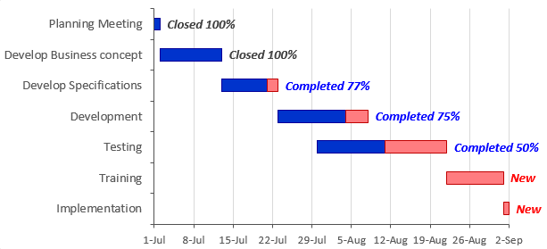
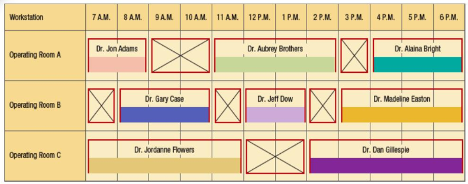

# Week 8

## Chapter 10: Operations Planning and Scheduling

### Scheduling

* Scheduling is what takes operations and scheduling process from planning to execution, "where the rubber meets the road".
* Schedules can be displayed in various ways.
  * List job due dates
  * Show start and finish times in table
  * Graph start and finish times
    * *Gantt Progress Chart*. Graphically displays the current status of each job or activity relative to its scheduled completion date.

    

    * *Gantt Workstation Chart*. Graphically displays the on and off time for a workstation.

    

**workforce scheduling**: a type of scheduling that determines when employees work

* Specifies the on-duty and off-duty periods for each employee over a certain time period.
* Constraints limit management's flexibility in developing workforce schedules.
* **rotating schedule**: a schedule that rotates employees through a series of workdays or hours
* **fixed schedule**: a schedule that calls for each employee to work the same days and hours each week

#### Sequencing Jobs at a Workstation

**sequencing**: determining the order in which jobs or customers are processed in the waiting line at a workstation

* Coupled with the expecting processing times, one can estimate the start and finish times of each job use a workstation Gantt chart to display the schedule.
* **priority sequencing rule**: a rule that specifies the job or customer processing sequence when several jobs are waiting in line at a workstation
  * **first-come, first-served (FCFS)**: a rule that specifies that the job or customer arriving at the workstation first has the highest priority
  * **earliest due date (EDD)**: a rule that specifies that the job or customer with the earliest due date is the next job to be processed
    * A product can not be assembled until all of its purchased and produced components are available. Which means that their due date is the start date for the assembly of the product.
    * **expediting**: the process of completing a job or finishing with a customer sooner than would otherwise be done
  * Neither rule guarantees finding an optimal solution.
* The quality of a schedule can be judged in various ways.
  * **flow time**: the amount of time a job spends in the service or manufacturing system, also known as throughput time or time spent in the system
    * Flow time = Finish time + Time since job arrived at workstation
    * Assumes that first job scheduled starts at time 0.
  * **past due**: the amount of time by which a job missed its due date, also known as tardiness
    * Minimizing this time supports the competitive priorities of cost (penalties for missing due dates), quality (perceptions of poor service), and time (on-time delivery).

**advanced planning and scheduling (APS) systems**: computer software systems that seek to optimize resources across the supply chain and align daily operations with strategic goals

## Supplement D: Linear Programming

**linear programming**: a technique that is useful for allocating scarce resources among competing demands

* Can be time, money, or materials

### Characteristics of Linear Programming Models

* **objective function**: an expression in linear programming models that states mathematically what is being maximized or minimized
* **decision variables**: variables that represent the choices the decision maker can control
  * Assumed to be continuous (need not be whole numbers). Even when used by non-divisible units like people, simply round up (or down) the solution as to violate any constraints.
* **constraints**: limitations that restrict the permissible choices for the decision variables
  * *<=* places an upper limit and is most often used with maximization problems.
  * *=* is often used for mandatory relationships, such as ending inventory always equals beginning inventory plus production minus sales.
  * *>=* places a lower limit and is used for minimization problems.
* **feasible region**: a region that represents all permissible combinations of the decision variables in a linear program
  * Typically an infinite amount of solutions that the decision maker must find one. Possible to be only possible solution or none.
* **parameter**: a value that the decision maker cannot control and that does not change when the solution is implemented
  * A parameter is assumed to be known with *certainty* (i.e. a fact that is known without doubt).
* **linearity**: a characteristic of linear programming models that implies proportionality and additivity - there can be no products or powers of decision variables
* **nonnegativity**: an assumption that the decision variables must be positive or zero

### Formulating a Linear Programming Model

**product-mix problem**: a one-period type of planning problem, the solution of which yields optimal output quantities (or product mix) of a group of services or products subject to resource capacity and market demand constraints

1. *Define the decision variables*.
   * Make definitions as specific as possible.
2. *Write out the objective function*.
   * What is to be maximized or minimized?
   * Identify parameters to go with each decision variable.
     * If a variable has no impact on objective function, its parameter (or coefficient) is 0.
3. *Write out the constraints*.
   * What limits the values of the decision variables?
   * Identify the constraints and the parameters for each decision variable in them.

**binding constraint**: a constraint that helps form the optimal corner point; it limits the ability to improve the objective function

### Computer Analysis

The simplex procedure in computer codes is some form of the *simplex method*.

**simplex method**: an iterative algebraic procedure for solving linear programming problems

**degeneracy**: a condition that occurs when the number of nonzero variables in the optimal solution is less than the number of constraints

### The Transportation Method

**transportation problem**: a special case of linear programming that has linear constraints for capacity limitations and demand requirements

**transportation method**: a more efficient solution technique than the simplex method for solving transportation problems

## Supplement J: Operations Scheduling

**operations scheduling**: a type of scheduling in which jobs are assigned to workstations or employees are assigned to jobs for specified time periods

### Performance Measures

* Flow time and past due are important measures that are important but can be insufficient depending on the competitive priorities of a process. Additional performance measures include:
  * *Makespan*. The total amount of time required to complete a group of jobs.
    * Makespan = Time of completion of last job - Starting time of the first job
  * *Total inventory*. the sum of scheduled receipts and on-hand inventories.
  * *Utilization*. The degree to which equipment, space, or the workforce is currently being used, and is measured as the ratio of average output rate to maximum capacity expressed as a percent
* Measures are often interrelated, i.e. minimizing the average flow time tends to increase utilization.

### Sequencing Jobs

* **job shop**: a manufacturer's operation that specializes in low- to medium-volume production and utilizes job or batch processes
  * Similar to *front office* in service operations because of the variability in job routings and the continual introduction of new jobs to be processed.
* **flow shop**: a manufacturer's operation that specializes in medium- to high-volume production and utilizes line or continuous flow processes.
  * Similar to *back office* in service operations. Tasks are easier to schedule because they have a common flow pattern through the system.
* Some additional priority sequencing rules (other than FCFS and EDD) include:
  * *Critical ratio (CR)*. a ratio that is calculated by dividing the time remaining until a job's due date by the total shop time remaining for the job, which is defined as the setup, processing, move, and expected waiting times of all remaining operation being scheduled.

    
  
  * *Shortest processing time (SPT)*. A rule that specifies that the job requiring the shortest processing time is the next job to be processed.
  * *Slack per remaining operations(S/RO)*. A rule that determines priority by dividing the slack by the number of operations that remain, including the one being scheduled.

    

* While the rules seem simple, the actual task of scheduling hundred of jobs through hundreds of workstations requires intensive data gathering and manipulation.

**single-dimension rules**: a set of rules that bases the priority of a job on a single aspect of the job, such as arrival time at the workstation, the due date, or the processing time

* EDD performs well with respect to the percentage of jobs past due and the variance of hours past due.
* SPT tends to minimize the mean flow time and the percentage of jobs past due. Often referred to as the *world champion*.
  * The advantage of this rule over others diminishes as the load on the shop increases.
* FCFS is considered fair to jobs (or customers), but performs poorly with respect to all performance measures.

**multiple-dimension rules**: a set of rules that apply to more than one aspect of a job

**Johnson's rule**: a procedure that minimizes makespan when scheduling a group of jobs on two workstations

1. Scan the processing times at each workstation and find the SPT among the jobs not yet scheduled. If two or more jobs are tied, choose one job arbitrarily.
2. If the SPT time is on workstation 1, schedule the corresponding job as early as possible. If the SPT is on workstation 2, schedule the corresponding job as late as possible.
3. Eliminate the last job scheduled from further consideration. Repeat steps 1 and 2 until all jobs have been scheduled.

**labor-limited environment**: an environment in which the resource constraint is the amount of labor available, not the number of machines or workstations

## Chapter 14: Supply Chain Integration

**supply chain integration**: the effective coordination of supply chain processes through the seamless flow of information up and down the supply chain

* When a link in the supply chain fails, whether it is an internal process or one at a supplier, the rest of the chain feels the effects.
* **supply chain risk management**: the practice of managing the risk of any factor or event that can materially disrupt a supply chain, whether within a single firm or across multiple firms

### Supply Chain Disruptions

#### Causes of Supply Chain Disruptions

* Result in cost increases, loss of reputation, civil and criminal penalties, bankruptcies, lost customers, or reduced revenue, profit, and market share.
* External causes include:
  * *Environmental disruptions*. Includes natural disasters, terrorism, political instability, regulatory changes, and strikes.
  * *Supply chain complexity*. Any increase in the number of suppliers or changes in the configuration have the potential to cause disruptions in supply chain.
  * *Loss of major accounts*.
  * *Loss of supply*.
  * *Customer-induced volume changes*. Customers may change the quantity of a product ordered and bring unexpected demand.
  * *Service and product mix changes*. The change in mix can cause imbalances in inventory.
  * *Late deliveries*.
  * *Underfilled shipments*.
* Internal causes include:
  * *Internally generated shortages*. Caused by machine breakdowns, lengthy setup times, limited capacity and bottlenecks, or inexperienced workers.
  * *Quality failures*. Product recalls cause huge costs and supply chain disruptions.
  * *Poor supply chain visibility*. Not being able to "see" the inventories and capabilities of suppliers poses a risk to the performance of the firm.
  * *Engineering changes*. A change to thee design of services or products can have a direct impact on suppliers.
  * *Order batching*.
  * *New service or product introductions*.
  * *Service or product promotions*.
  * *Information errors*.

#### Supply Chain Dynamics

**bullwhip effect**: the phenomenon in supply chains whereby ordering patterns experience increasing variance as you proceed upstream in the chain

* Firms must react to the demands placed on them by downstream members of the chain. Slightest change in customer demands can ripple through the entire chain.
* **SCOR model**: a framework that focuses on a basic supply chain of plan, source, make deliver, and return processes, repeated again and gain along the supply chain

### Additive Manufacturing

**additive manufacturing (AM)**: the technologies that build 3D objects by adding layers of material such as plastic, metal, or concrete
