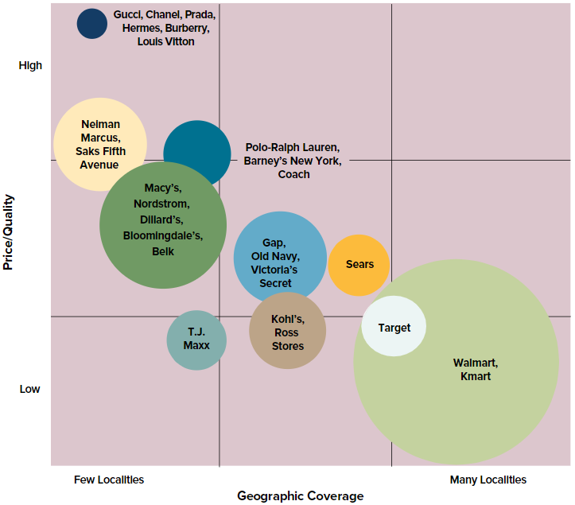

# Week 3

## Chapter 3: Evaluating a Company's External Environment

In order to to wisely chart a company's strategic course, managers must first develop a deep understanding of the company's present situation, focusing on two facets:

1. The industry and competitive environment in which the company operates and the forces acting to reshape this environment
2. The company's internal environment - its resource and capabilities, its strengths and weaknesses in respect to rivals, and its windows of opportunity

### The Strategically Relevant Factors Influencing a Company’s External Environment

* A company's macro-environment includes all factors and influences outside the company's boundaries that are strategically relevant enough to have a bearing on the decision the company ultimately makes about its direction.
  * Sometimes difficult to discern the level of impact the macro-environment will have on a company.
  * Important managerial responsibility to scan external environment for important developments
* Five outer-ring components of a company's macro-environment
  * General economic conditions
    * inflation, consumer confidence, stock market conditions
  * Political, legal, and regulatory influences
    * Tougher/more lenient regulation, tariffs, politicians
  * Technological influences
  * Sociological influences (values, lifestyles, and shifting population demographics)
  * Considerations relating to the natural environment

***To assess a company's industry and competitive environment, managers must ask the following six questions.***

### What competitive forces do industry members face, and how strong are they?

* Since character, mix, and subtleties differ from industry to industry, the five forces model of competition is used to systematically diagnose the principal competitive pressure.
  1. Competitive pressures stemming from the market maneuvering and strategy initiatives of industry rivals
     * First identify which pressure it is associated with, determine the pressure and whether it will helpful for high/good industry profitability.
     * Many factors can influence the tempo of rivalry.
       * Intensifies when competing sellers are active in launching fresh actions and weaker when sellers aren't making many moves
       * Intensifies when buyer demand is growing slowly or falling and weakens when demand is growing rapidly
       * Intensifies as the products of sellers become *less* differentiated
       * Intensifies as industry members have too much inventory or significant amounts of idle production capacity
       * Intensifies when a product is costly to hold in inventory, perishable, or seasonal
       * Intensifies when a competitors become more equal in size and capability and the number of competitors increases (up to a point)
       * Intensifies when one or more competitors become dissatisfied with their sales volume and launch offensives to steal business
       * Intensifies when strong companies outside industry acquire weak firms within the industry and launch well-funded moves to make them strong market contenders
       * Intensifies when competitors have diverse views about where the industry is headed
  2. Competitive pressures stemming from the threat of new entrants into the market
  3. Competitive pressures stemming from companies in other industries selling substitute products
     * New entrants typically compete aggressively to gain a market foothold and expand their customer base, taking away from current industry members. The seriousness of threat is determined by:
       * Whether entry barriers are high or low
       * Cost advantages for incumbents
       * Strong brand preferences and high degrees of customer loyalty
       * High capital requirements
       * Difficulty of building a network of distributors or retailers and securing adequate space on retailers shelves
       * Restrictive or costly regulatory policies
       * Tariffs and international trade restrictions
       * Expected reaction of existing industry members to entry of newcomers
       * The size of the pool of likely entry candidates and the degree to which they have the resources and capabilities to become competitors
  4. Competitive pressures stemming from the exercise of supplier bargaining power
  5. Competitive pressures stemming from the exercise of buyer bargaining power
     * Buyers bargaining strength increases when:
       * Buyer demand is weak in relation to available supply
       * When industry member products are standardized "commodities" or weakly differentiated
       * When buyers have low costs in switching to competing brands or substitutes
       * When the number of buyers is small
       * When buyers pose a credible threat of integrating backward into the business of sellers
       * When buyers have discretion to delay their purchases or not make a purchase at all
* The stronger the collective impact of the five competitive forces, *the lower the combined profitability of industry participants*.
  * Industries like tire manufacturing, apparel, and commercial airlines are characterized by intense competitive conditions and historically thin profit margins.

### What forces are driving changes in the industry, and what impact will these changes have on competitive intensity and industry profitability?

**driving forces**: major underlying causes of changing industry and competitive conditions

* Driving-forces analysis has three steps:
  1. Identifying what the driving forces are
     * Driving forces usually fall into the following categories:
       * Changes in an industry's long-term growth rate
         * Strong growth leads companies to compete for new sales opportunities
         * Slow growth intensifies rivalry for existing market share
         * Stagnant or declining growth may force some companies to opt out and sell operations to those who stick it out
       * Increasing globalization
         * Differences in labor costs, customers from previously closed markets
       * Emerging new Internet capabilities and applications
       * Changes in who buys the product and how buyers use it
       * Product innovation
       * Technological change and manufacturing process innovation
       * Marketing innovation
       * Entry or exit of major firms
       * Diffusion of technical know-how across more companies and more countries
       * Changes in cost and efficiency
       * Growing buyer preferences for differentiated products instead of a commodity product (or vice versa)
       * Reductions in uncertainty and business risk
       * Regulatory influences and government policy changes
       * Changing societal concerns, attitudes, and lifestyles
  2. Assessing whether the drives of changes are, on the whole, acting to make the industry more or less attractive
     * Will demand increase or decrease?
     * Will competition become less or more intense?
     * Will it lead to higher or lower industry profitability?
  3. Determining what strategy changes are needed to prepare for the impacts of the driving forces

### What market positions do industry rivals occupy - who is strongly positioned and who is not?

**strategic group**: a cluster of industry rivals that employ similar competitive approaches, have product offerings that appeal to similar types of buyers, and thus similar market positions

**strategic group mapping**: a technique for displaying the different market positions that rival companies occupy in the industry

* To draw a strategic group map, one has to:
  * Identify the competitive characteristics that differentiate firms in the industry.
    * price/ quality range (high, medium, low)
    * geographic coverage (local, regional, national, global)
    * product-line breadth (wide, narrow)
    * degree of services offered (no-frills, limited, full)
    * use of distribution channels (one, some, all)
    * degree of vertical integration (none,partial, full)
  * Plot the firms on a two-variable map using pairs of characteristics.
  * Assign firms that are located close together on map to the same strategic group.
  * Draw circles around each strategic group, making the circles proportional to the size of the group's share of total industry sales revenues.
    * Reflects the relative market share that each strategic group commands.
* It is important that the two variables used are not highly correlated.
* Reveals who are close rivals and who are distant rivals.
* Not all positions on map are equally attractive. One must draw conclusions on where the "best" place is to be on the map and why.

### What strategic moves are rivals likely to make next?

* Closely monitoring the actions of competitors and preparing a defense against their expected next moves reduces the risk of being caught napping and suffering a damaging loss of sales and profits.
* Can somewhat gauge strategic moves by asking the following questions.
  * Which competitors have strategies producing good results, making it more likely that only minor strategic adjustments will be made?
  * Which competitors are losing ground in the marketplace, making them more likely to alter prices, improve appeal of product offering, move to a different part of the strategic group map, etc.?
  * Which rivals badly need to increase their unit sales and market share?
  * Which rivals are likely to enter new geographic markets or make major moves to improve market share in a particular geographic region?
* Can be tedious but allows managers to prepare effective countermoves (or even beat a rival to the punch)

### What are the key factors for future competitive success?

**key success factors (KSFs)**: strategy elements, product attributes, resource strengths, competitive capabilities, and market achievements with the greatest impact on future competitive success in the marketplace

* important to future competitive success so all firms must pay close attention to them
* Vary from industry to industry
* Can be determined by the following three questions
  * On what basis do buyers of the industry's product or service choose between competing brands?
  * Given the nature of the competition, what resources and capabilities must a company have to be competitively successful?
  * What shortcomings are almost certain to put a company at a significant competitive disadvantage?
* Rarely more than five key factors for future competitive success and usually two or three outran the others in importance
* Correctly diagnosing an industry's KSFs also raises a company's chances of crafting a sound strategy
* To be a winner, a company’s strategy must compare favorably with rivals on all industry KSFs and be competitively superior on one, maybe two, of the industry’s KSFs.

### Is the industry outlook conducive to good profitability?

* The important factors on which to base such a conclusion include;
  * Whether the industry/company is being favorably/unfavorably impacted by macro-environmental factors
  * Industry's growth potential
  * Strength of competitive forces
  * Driving forces
  * Whether the company is strongly/weakly positioned on the industry's strategic group map
  * How well the company's strategy, product offering, and capabilities stack up against industry KSFs
  * the degrees of risk and uncertainty in the industry's future
* The degree to which an industry’s outlook is attractive or unattractive is not the same for all industry participants and all potential entrants. Some companies may be strongly positioned with the strategies and competitive strengths to capture the opportunities an industry presents; others may not.
