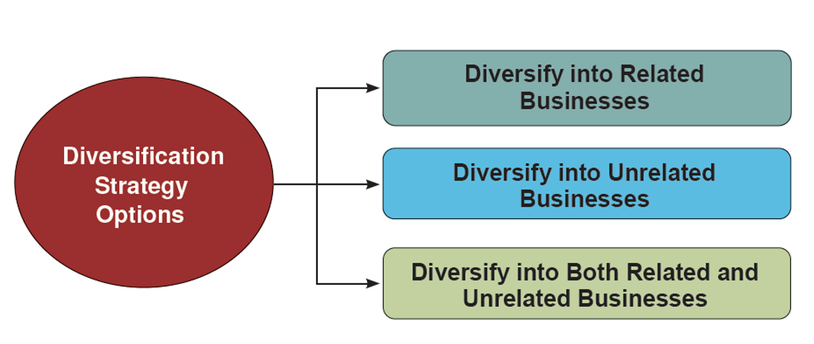
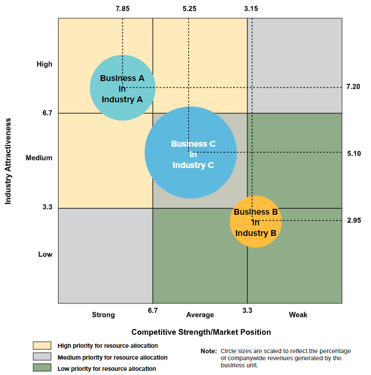

# Week 7

## Chapter 8: Diversification Strategies

* A firm is diversified when it operates in two or more lines of business that are in distinctly different industries.
* Diversification complicates the strategy-making task because it requires:
  * Assessing the multiple industry environments of a collection of individual businesses
  * Developing a separate business strategy for each industry area in which the diversified firm operates
  * Devising a corporate strategy for improving the attractiveness and performance of the company's overall business lineup and for making a rational whole out of its diversified collection of individual businesses and individual business strategies

### What Does Crafting a Diversification Strategy Entail?

1. Picking new industries to enter and deciding whether to enter the industry by start-up, acquisition, or a joint venture or strategic alliance with another firm
2. Pursuing opportunities to leverage cross-business value chain relationships and strategic fits into competitive advantage
3. Evaluating the growth and profitability prospects for each business, establishing investment priorities for each business, and then using these priorities to steer corporate resources to individual businesses
4. Initiating actions to boost the combined performance of the corporation's collection of businesses

#### When to Consider Diversifying

* There is no urgency for a single-business firm to diversify if it has ample opportunities for growth and profitability
* A single-business firm becomes a prime candidate for diversifying when:
  * Industry conditions turn sour and are expected to be long-lasting
  * Opportunities arise to expand into industries which complement present business
  * Current competencies and capabilities are KSFs and valuable competitive assets for competing in another business
  * Diversifying into closely related businesses will reduce its costs
  * Owns a powerful brand name that can be transferred to other industries and help drive sales and profits
* A firm can diversify:
  * Into closely-related or totally-unrelated businesses
  * Its present revenue and earning base to a small extent or to a major extent
  * Into a one or two large new businesses or a greater number of small ones
  * By acquiring an existing firm in a business/industry it wants to enter
  * By forming a subsidiary in promising industry
  * By forming joint ventures with other firms to enter new businesses

**synergy**: creating added long-term value for shareholders via diversification where whole is greater than than the sum of its parts (1+1=3)

#### Diversification Tests

1. Industry Attractiveness Test
   * Industry conditions must be conducive to good profitability.
2. Cost-of-Entry Test
   * High cost of entering cannot spoil the profit opportunities.
3. Better-Off Test
   * Diversifying must offer potential for the firm's businesses to perform better together under a single corporate umbrella than they would perform as independent stand-alone businesses
   * 1+1=2 is not the goal of diversification. Must perform better together.

### Choosing the Diversification Path: Related vs. Unrelated Businesses

**related diversification**: involves diversifying into businesses whose value chains posses competitively valuable "strategic fits" with the value chain(s) of the firm's present business(es)

**unrelated diversification**: involves diversifying into businesses having no competitively valuable value chain match-ups or strategic fits with the value chain(s) of the firm's present business(es)

#### Case for Diversifying into Related Businesses

**strategic fit**: exists when the value chains of different businesses present opportunities for cross-business resource transfer, lower costs through combining the performance of related value chain activities, cross-business use of a potent brand name, and/or cross-business collaboration to build new or stronger competitive capabilities

* It offers a competitive advantage over business rivals whose operations do not offer comparable strategic fit benefits
* Competitive advantage includes benefits of:
  * Transfer of competitively valuable expertise from one business to another
  * Combining the related value chain activities of separate businesses into a single operation to lower costs
    * **economies of scope**: cost reductions that flow from operating in multiple businesses
      * Using the same plant or distribution center
    * Not to be confused with *economies of scale* or cost savings that occur because a large-scale operation is more cost-efficient than a small-scale operation.
  * Cross-business use of a well-respect brand name
  * Cross-business collaboration to create altogether new competitively valuable resources and capabilities

#### Case for Diversifying into Unrelated Businesses

* Unrelated diversification strategies involve:
  * Entering any industry and operating any business where there is opportunity to realize good financial results
  * No deliberate effort to diversify into businesses with strategic fits
  * Acquiring an established company rather than forming a start-up subsidiary or collaborating in a joint venture to get into a new business
  * An acquisition passing both the industry attractiveness and cost-of-entry tests and having good prospects for financial performance
* What is appealing about unrelated diversification?/
  * Risk is scattered over a set of truly diverse industries.
  * Financial resources can be used to maximum advantage by:
    * Diverting cash flow away from low growth/profit prospects into high growth/profit potential
    * Investing in whatever industries offer the best profit prospects
  * Shareholder wealth can be handed by buying distressed businesses at low price, turning the operations, and either selling it or enjoy profit increases
    * If managers are astute at spotting this value
* The two big drawbacks of unrelated diversification
  * Demanding managerial requirements
    * Makes it hard to
      * Discern good acquisitions from bad ones
      * Have in-depth knowledge about each of the businesses
        * To know what to do if a business stumbles
      * Avoid big mistakes
    * It is better to have a *few* unrelated businesses than *many*.
  * Limited competitive advantage potential
    * Limited to what each separate business can generate on its own
    * Far tougher to achieve 1+1=3 levels

**Overall is a riskier and more problematic approach to diversifying than a strategy of related diversification.**

#### Combination Related-Unrelated Diversification Strategies

* The business make-up of diversified firms varies considerably
  * **Dominant-business firms**: One major core business that accounts for 50-80 percent of total revenues with several smaller businesses for the rest.
  * **Narrowly diversified businesses**: Have a few (2-5) related or unrelated businesses
  * **Broadly diversified firms**: Wide-ranging collection of either related, unrelated or a mixture of both b
  * **Diversified firms that have diversified into unrelated areas but have a collection of related businesses within each area**: a portfolio of several unrelated groups of related businesses
* How to evaluate and improve a diversified firm's strategy
  1. Assess long-term of each industry in which the firm has a business.
       * Does each industry represent a good industry to be in?
       * How appealing is the whole group of industries in which the company has invested?
       * Measures that go into calculating attractiveness:
         * Market size and projected growth rate
         * The intensity of competition
         * Emerging opportunities and threats
         * The presence of cross-industry strategic fits
         * Resource and capacity requirements
         * Seasonal and cyclical factors
       * Assign importance weights, rate on each attractiveness measure, multiply by weights and sum to get weighted industry attractiveness score.
  2. Assess competitive strength of each of the firm's business units.
      * Measures of competitive strength include:
        * **relative market share**: defined as the ratio of its market share to the market share held by the largest rival firm in the industry, measure in unit volume not dollars
          * Analytically superior to using straight-percentage market share
        * Costs relative to competitors
        * Ability to match or beat rivals on key product attributes
        * Ability to benefit from strategic fits with sister businesses
        * Ability to exercise bargaining leverage with key suppliers or customers
        * Brand image and reputation
        * Other competitively valuable resources and capabilities
        * Profitability relative to competitors
      * Use a nine-cell matrix to simultaneously portray industry attractiveness and competitive strength

        
  3. Evaluate competitive advantage potential of cross-business strategic fits among the various business units.
      * The greater the competitive value of cross-business strategic fits, the more competitively powerful is a firm's related diversification strategy.
  4. Check whether firm's resources fit requirements of its present businesses.
      * A diversified firm's collection of business exhibit resources fit when:
        * Its various sister businesses add to its overall resource strengths.
        * It has adequate financial and non-financial resources to support its entire group of businesses without spreading itself too thin.
      * Resource fit concerns whether each company business has adequate access to the resources and capabilities need to be competitively successful and whether the corporate parent has the financial means and parenting capabilities to support its entire group of businesses.
      * **cash hog**: generates cash flows that are too small to fully fund its operations and growth
        * Requires cash infusions to provide additional working capital and finance new capital investment
        * Strategic options include:
          * Invest to grow them into *star businesses* (strong, profitable market contenders)
          * Divest cash hogs with questionable promise. Redeploy resources from divested cash hogs to better advantage elsewhere.
      * **cash cow**: generates cash flows over and above its internal requirements
        * Provides funds for investing in cash hog businesses, financing new acquisitions, or paying dividends
      * There are also nonfinancial resource fits
        * a diversified firm must have a sufficiently large and talented pool of managerial, administrative, and resource capabilities to support all of its businesses
  5. Rank performance prospects of businesses and determine priority for resource allocation.
      * General rule, is business units with brightest profit and growth prospects should receive top priority for allocation of corporate resources
      * Past performance may also have merit
        * Sales and profit growth
        * Contribution to company earnings
        * Return on capital invested in business
        * Cash flows from operations
      * Management must be diligent in:
        * Steering resources to those businesses with the best opportunities and performance prospects
        * Allocating few, if any, additional resources to businesses with weak prospects
  6. Craft new strategic moves to improve overall company performance.
      * Strategic options to improve a diversified firm's overall performance fall into five broad categories of actions
        * Sticking closely with the existing business lineup and pursuing the opportunities these businesses present
        * Broadening the firm's business scope by making acquisitions in new industries
        * Divesting under-performing businesses and retrenching to a narrower base of business makeup
        * Restructuring the firm's business lineup and putting a whole new face on the firm's business makeup
        * Pursuing multinational diversification and striving to globalize the operations of the firm's business units
