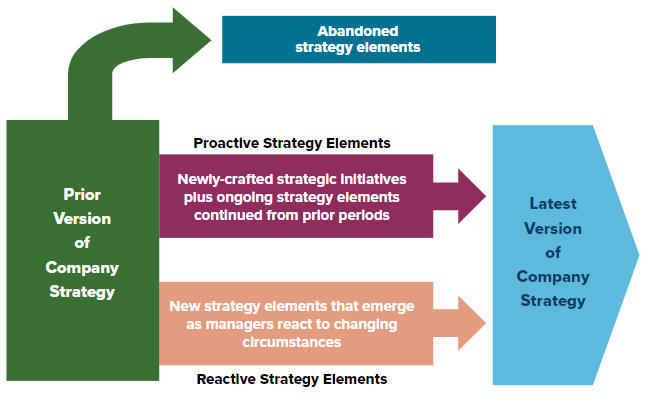

# Week 1

## Chapter 1: What is Strategy and Why Is It Important?

**strategy**: consists of the competitive moves and business approaches that managers employ to attract and please customers, compete successfully, pursue opportunities to grow the business, respond to changing market conditions, conduct operations, and achieve the targeted financial and market performance

* Represents *managerial commitment to undertake one set of actions rather than another*.
* Can compute based on features, warranties, clever advertising, brand-name recognition, etc.
* Also determined of where companies seek to position themselves in the market (high-end vs. low-end, broad appeal vs. niche , local vs. national vs. international)
* Competing differently is a major component of a good strategy. Mimicking others does not work well. You need to set yourself apart from the competition.

**competitive advantage**: an edge over rivals in attracting buyers and coping with competitive forces

* Involves providing buyers with what they perceive as superior value compared to offerings of rival sellers
* Five of the most frequently used approaches to competitive advantage include:
  * Low-cost provider (i.e. Walmart, Southwest Airlines)
  * Differentiating features (i.e. Apple)
  * Best-cost provider (i.e. Toyota, L.L. Bean)
  * Niche (i.e. Jiffy Lube - quick oil changes, eBay - online auctions)
  * Develop valuable resources and capabilities that rivals can't easily imitate or trump (i.e. Disney - entertainment/theme park management)
* A company will earn significantly higher profits with a competitive advantage.
* A competitive advantage is sustainable (or durable) if it causes an attractive number of buyers to have lasting reasons to purchase a company's products or services, despite the efforts of the competition.

### Why a Company's Strategy Evolves over Time

All companies must change because of changing market conditions, advancing technology, fresh moves of competitors, shifting buyer needs/preferences, emerging market opportunities, new ideas for improving the strategy, or evidence that the present strategy isn't effective.

* Usually happens incrementally.
* Sometimes requires major shifts if changes are dramatic.
* The present strategy should always be temporary and on trial. Should always be fluid.

### A Company's Strategy is Partly Proactive and Partly Reactive

* A strategy should consist of 1) proactive actions to secure a competitive edge and improve the company's financial performance and 2) as-needed reactions to fresh market conditions and other unanticipated developments

  

### Strategy and Ethics

* Just keeping a strategy within the bounds within what is legal is not enough.
* A strategy is ethical only if it does not entail actions and behaviors that cross the moral line from "can do" to "should not do".
* Reputational and financial damage from unethical strategies can be substantial.
  * Affect revenues and stock prices
  * Usually turns off consumers
  * Employees with character/integrity do not want to work for shady companies

### Relationship between a Company's Strategy and Its Business Model

**business model**: a management's blueprint for delivering a valuable product or service to customers in a manner that will generate revenues sufficient to cover costs and yield an attractive profit

* Two crucial elements are:
  * customer value proposition - lays out the customer's approach to satisfying buyer needs and requirements at a price they will consider good value
  * profit proposition - concerns business approach to generating sufficiently large revenues and controlling the costs of its customer value proposition
* Three outcomes are required for satisfied customers/shareholders:
  * Revenue stream must be big enough to cover the costs of delivering attractive value to customers.
  * Adequate ways and means to control the costs of the value being delivered to customers.
  * Amounts by which revenues exceed the costs incurred must please shareholders.

### What Makes a Strategy a Winner?

Three tests can be applied to determine the merits of one strategy versus another and distinguish a winning strategy from a mediocre or flawed strategy.

1. **The Fit Test**. How well does the strategy fit the company's strategy?
   * Must be well matched to industry and competitive conditions, as well as company's resources and competitive capabilities.
2. **The Competitive Advantage Test**. Is the strategy helping the company achieve a sustainable competitive advantage?
3. **The Performance Test**. Is the strategy producing good company performance?
   * Competitive strength and market standing
   * profitability and financial strength
   * Gains in market share, above-average profitability are good signs.

It is more appealing to to pass all three tests with flying colors than to come up short on one or more.

### Why Crafting and Executing Strategy are Important Tasks

* A clear and reasoned strategy is key to a businesses staying at the top of competition.
  * Flawed or copycat strategies don't make companies successful.
* Even the best-conceived strategies will fail if they are not executed proficiently.
  * Must be able to have an organization with the skills, resource capabilities, operating practices to execute strategy.
