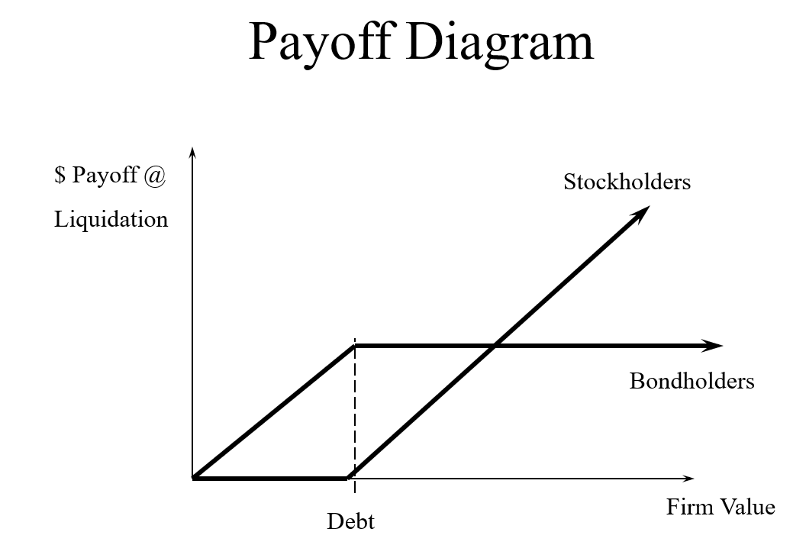

# Fundamental Financial Principles

1. The principle of **self-interested behavior**.  People act in their own self-interest and in their own financial self-interest.
2. The principle of **two-sided transactions**. For every buyer there is a seller.  This principle combined with the principle that both the buyer and seller are acting in their own self-interest tends to market markets very efficient, meaning that market prices tend to reflect all relevant information and assets tend to be appropriately priced.  If this was not true, the buyer and/or seller would act in their own self interest, and their actions would push the prices to a more efficient/appropriate level.
3. The **signaling principle** and the behavioral principle.  Actions convey information.  When all else fails, look what others are doing for guidance.
4. The principle of **valuable ideas** and **comparative advantage**.  Comparative advantage and/or valuable ideas can contribute to value creation.
5. The **options principle**.  Options are valuable and are often hidden.
6. The principle of **incremental benefits**.  Relate this to the economics topic of marginal analysis.  Financial decisions are based on incremental, aka marginal, analysis.
7. The principle of **risk-return trade-off**.  There is a pervasive trade-off.  Investors will not accept more expected risk, unless they expect to be compensated for it.  All risk is not equal, some can be easily diversified away.
8. The principle of **diversification**. On average, diversification is beneficial.
    - Don't put all of your eggs in one basket.
9. The principle of **capital market efficiency**.  Capital markets (i.e. market prices) reflect all relevant information quickly.  Assets tend to be appropriately priced based on the relevant information available to market participants.  It is hard to find exceptionally profitable investments.
    - The movement of stock prices is only done through *new* information, making it hard for any individual to predict stocks that perform exceptional profitability or loss.
    - *arbitrage* - trading strategy in which an investor simultaneously buys and sells the same asset in different markets, to earn an instant, risk-free profit
        - Extremely rare because they are too good to last.
10. The **time value of money** principle.  The value of cash flows (money) depends critically on time.
    - A dollar today is worth more than a dollar in the future because of the *ability to invest and earn interest*.
11. The principle that **cash is king**, not profits.  After Tax Cash flows (ATCF), not profits, create value.
12. The **agency problem** principle.  Agency problems, aka conflicts of interest, are pervasive.  Managers won't work for owners.

## Video: [*"Finance: What Managers Need to Know"*](http://www.youtube.com/watch?v=aJsmJsd6GIw)

> Interview of Joe Knight, coauthor of Financial Intelligence series

- Accounting takes transactions and figures out how to create historical information about what is happening with the business.
- Finance takes accounting and makes business decisions.
- If there are a large number of people looking at the finances of a business, there is less opportunity for fraud.
- Profit and cash flow are different.
  - Profit is counted when you make a sale. *Does not mean you have received the money.*
  - We buy products (trucks, buildings) with cash but depreciate these items in the financial statements. It consumes the cash but we appear profitable because of depreciation.
  - We only incur expenses when we receive the service.

> The cash flow statement has become increasingly more important for businesses.

## Textbook: *"Chapter 1: The Scope of Corporate Finance"*

**corporate finance** - the practice of managing the money that flows in and out of businesses

### What Financial Managers Do

1. *Financing* - raise capital to support a company's operations and investment programs
    - Can be done externally, from investors or creditors, or internally, by retaining operating cash flows
    - **equity:** ownership interest
    - **debt:** money borrowed from creditors
        - *money market* - market for debt instruments maturing in one year or less
        - *notes* - debt with original maturities of less than seven years
        - *bonds* - debt with original maturities of more than seven years
    - IPO -> initial public offering
        - In a primary market transaction, money flows from investors to firms. Secondary market transactions occur between investors and generate no cash for the firm, but an active secondary market makes the security more attractive, increasing the price.
2. *Financial Management* - managing a firm's day-to-day cash flows, including payments to suppliers and receipts from customers, determining optimal holdings of short-term assets, etc.
3. *Capital budgeting* - selecting the best projects in which to invest the firm's resources, based on each project's perceived risk and expected return
4. *Risk management* - managing the firm's exposure to risk in order to main the optimum risk-return trade-off and therefore maximize shareholder value
    - **hedge:** offset
5. *Corporate governance* - developing a structure capable of ensuring that managers act ethically and in stockholders' interests
    - Promote qualified honest people and structure employee financial incentives to motivate them to maximize firm value. Difficult to do in practice because stakeholders' interests typically conflict. Ways to mitigate this:
        - Board of directors
            - Develops *fixed* and *incentive* compensation packages
        - Auditors
        - Securities and Exchange Commission (SEC)
            - responsible for the fair reporting of financial information to investors in public companies
            - Enforce Sarbanes-Oxley Act of 2002. Requires firms:
                - To provide extensive documentation of  of internal controls they put in place to protect investors from fraud
                - CFO to personally vouch for accuracy of numbers

## Legal Forms of Business Organization

### Sole Proprietorships

- a business with a single owner, essentially no legal distinction between the business and its owner
- Owner bears all responsibility for the company's debts and pays income taxes on its earnings
- Weaknesses include:
  - *Limited life.* Proprietorship dies when founder retires or dies. Can trigger larger tax liabilities in event of transfer.
  - *Limited access to capital.* Can only obtain capital from reinvested profits or personal borrowing.
  - *Unlimited personal liability.* Liable to all debts including lawsuits.

### Partnerships

- a proprietorship with two or more owners
- There is a sharing of legal responsibility called joint and several liability.
- Doesn't require a written partnership agreement, but most have them.
- Only taxed once at personal level similar to proprietorship
- **limited partnership (LP)** is a partnership with:
  - general partners
    - unlimited personal liability
    - greater-than-proportional share of partnership income
  - limited partners
    - smaller share of income
    - Passive in operations
    - No personal liability for business debts

### Corporations

- a separate legal entity with many of the economic rights and responsibilities enjoyed by individuals
- Advantages include:
  - *Unlimited life.* Has perpetual life until is explicitly terminated.
  - *Limited liability.* Shareholders cannot be held personally liable for the firm's debts.
  - *Separable contracting.*  Can contract individually with mangers, suppliers, customers, and ordinary employees without affecting other stakeholders.
  - *Improved access to capital.* The company itself can borrow money from creditors and issue stock to equity investors.
    - Can be traded on the public securities market if public
- Owned by shareholders
- **Board of directors** are responsible for hiring and firing managers and setting overall corporate policies.
- **corporate charter** - legal document created at the corporation's inception to govern the firm's operations
- Subject to double taxation, at both company and personal levels
- **S Corporation:** allows shareholders to be taxed as partners while still retaining their limited liability status as corporate shareholders

### Limited Liability Companies (LLC)

- Combines the partnership's pass-through taxation with the S corporation's limited liability
- Even though LLCs can be taxed as partnerships, owners face no personal liability for the other partners' malpractice.

## Goals of the Corporate Financial Manager

- Should it be to maximize profit or shareholder wealth?
  - *Maximize Profits?*
    - Managers receive bonuses for reporting increased earnings. Increased earnings should mean increased earnings per share.
      - EPS focuses on what happened, rather than what happened.
      - Can boost EPS by forgoing things like maintenance, which may cause more harm in the future.
    - Focusing on only earnings ignores risk. Just making decisions based on what generates the most profit can paper over the risk.
      - Investments with high profits and high risk could be less valuable than one with lower profits and lower risk.
    - Hard to maximize profits without knowing how to measure them. Usually requires knowledge of accrual-based accounting principles rather than cash flow.
  - *Maximize Shareholder Wealth?*
    - **residual claimants:** exert claims on the firm's cash flows that remain after all other claimants are satisfied in full, also known as stakeholders
      - If a firm can't pay its employees, creditors, suppliers, and tax authorities, the shareholder gets nothing. So it is in the best interest of the shareholder to make sure decisions are made to meet those obligations.
      - This means that shareholders bare more risk. A firm must provide enough incentive for the shareholder to shoulder that risk.

