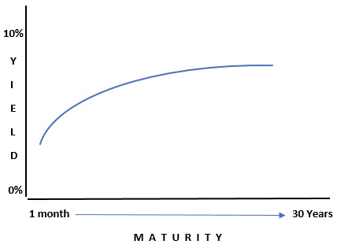

# Week 5

## Video: [*"Excel Finance Class 63: Stock Valuation with Dividend Growth Model "*](https://www.youtube.com/watch?v=cbRIhwkGAnQ)

### Dividend Growth Model

- When dividends are expected to grow at a constant percent per period *(growing perpetuity)*

## Textbook: *"Chapter 4: Valuation"*

### Valuation Fundamentals

**The value of any asset equals the present value of all of its future benefits.**

- The valuation process links an asset's risk and return to determine its price. Ultimately driven by size, timing, and risk of future cash flows.

*Fundamental valuation model*

- P0 represents the asset's price today (at time 0)
- CF1 represents the expected cash flow at time 1, etc.
- r is the required return (discount rate that captures asset's risk)

### Bond Valuation

- **coupon**: the fixed amount of interest a bond promises to pay investors
- **maturity**: the life of a bond; when a bond matures borrowers must repay investors a lump sum known as the bond's *face value, principal value, or par value*
- **coupon rate**: annual coupon payment divided by par value
- **coupon yield**: coupon payment divided by the bond's current market price *(not always equal to par value)*
- **bond indenture**: specifies the cash flow that the bond issuer pays to bondholder
- **risk-free bond**: a bond that has no chance of default by its issuer
  - Only bonds issued by the most credit-worthy national governments are viewed as risk-free by investors
- **zero-coupon bond**: a bond that makes no intermediate interest payments, promising a single fixed payment on a specified future date

*Formula for coupon-paying notes or bonds*

Bonds sell at a *discount* when the price is less than par value. Its sold at a *premium* when the price is more than par value.

- **yield to maturity (YTM)**: the discount rate that equates the present value of the bond's cash flows to its market price

#### Bond Issuers

- **corporate bonds**: issued by large companies that need money to fund new investments and fulfill other needs
  - carry *default risk*, risk that the corporation may not make all payments
  - Maturities range from 1-100 years
  - Typically referred to as note instead of bond
- **municipal bonds**: issued by state and local government entities
  - Bondholders can exempt interest received on municipal bonds from their federal income tax, which allows governments to raise money at lower interest rates
- **treasury bills**: issued by U.S. treasury, world's largest bond issuer, typically used to cover budget deficits
  - *Treasury note* maturity ranges from 1-10 years.
  - *Treasury bonds* maturities can extend up to 30 years.
- **agency bonds**: issued by federal government agencies and government-sponsored enterprises to finance operations

**bond rating**: an independent assessment of the risk of a publicly traded bond issue, typically represented by a letter grade

- Bonds with higher grades are classified as *investment-grade*.
- Lower grades are *junk bonds*, meaning they are more risky.

#### Bond Prices

- *Basis points* are how the spread in the yield to maturities of a corporate bond and a Treasury bond at roughly the same maturity. (100 basis points = 1 percentage point)
- Market value of a bond changes constantly for a variety of reasons:
  - **Passage of time:** as time elapses and maturity date gets closer, the price will converge to par value
  - **Economic forces:** A change in required return on a bond causes the price to change in the opposite direction

#### Term Structure Theories

**Expectations theory**: Investor expectation that if long-term bond yields exceed short-term bond yields - investors must expect short-term yields to rise and vice-versa.

### Advanced Bond Valuation

**Yield Curve**: represents the relationship between YTM and maturity for a group of similar bonds

*Normal yield curve*

- Long-term bonds typically offer higher yields than short-term bonds.
- The general rule is that yield on a bond must be sufficient to offer investors a positive *real return*.
- **real return**: difference between *nominal return* (or stated) and the inflation rate

*Inverted yield curve*

- Short term yields are above long-term yields
- Typically occur prior to and during recessions, which makes it a good predictor of economic downturn.

**liquidity preference theory**: states that the slope of the yield curve is influenced not only by expected interest-rate changes, but also by the liquidity premium that investors require on long-term bonds

**preferred habitat theory**: suggests that different bond investors prefer on maturity length over another and are only willing to buy bonds outside of their maturity preference if a risk premium for the maturity range is available, *also known as market segmentation theory*

### Stock Valuation

#### Preferred stock valuation

- Neither pure debt nor a pure equity instrument, preferred stock has characteristics of both
  - Pays investors a fixed cash flow stream over time (preferred dividend), which is typically expressed as a percentage of par value
  - Don't have legal right to force company into bankruptcy if company can't pay preferred dividend, unlike bondholders, similar to stockholders
  - If payment is skipped, payment is cumulative and company can't pay common stockholders until preferred stockholders are "caught up" (treated as a perpetuity)

    

    - PS0 represents today's value of preferred stock.
    - Dp represents preferred dividend.
    - rp represents rate of return of the preferred stock.
  - Represents under 5% of the net external financing for U.S. companies because of tax implications at corporate and stockholder level (cannot deduct preferred dividends similar to interest on debt, impractical to earn capital gains because of fixed dividend)
  - Pays a key role in venture capital financing

#### Common Stock Valuation

- Primary difference between bonds and common stocks is that common stocks have cash flows that are non-contractual and unspecified.

  

  - Indicates that the value of a stock today equals the present value of cash that the investor receives in one year

  

  - Price today equals the entire dividend stream that the stock will pay.

- **zero growth model**: assumes a constant dividend stream *(i.e. perpetuity)*

  

- **constant growth model**: assumes that dividends will grow at a constant rate *(i.e. growing perpetuity)*
  - also known as the **Gordon growth model**

    

- **variable growth model**: assumes that the dividend growth rate can vary

    

  - The first portion represents present value of dividends growing during initial growth period.
  - Bracketed portion represents present value of price of stock at end of initial growth period.

#### How to Estimate Growth

- A simple way to determine growth is to use company financial statements.

  

  - RR = retention rate *(i.e. fraction of the firm's earnings that it retains)*
  - ROE = return on common equity
- Can also use historical data to identify growth trends, but doesn't necessarily translate to future growth

**What if there are no dividends?**

- Most companies do not pay dividends at all (about 80% in a given year).
  - Modify equations to focus on dividends that may be paid in the future, but not guaranteed.
  - Can apply the model in terms of share buybacks, but not always.
- Use *free cash flow approach* which is the *total operating cash flow (OCF)* minus the amount needed to fund new investments in both fixed assets and current assets.
  - This represents the amount a firm *could* distribute to investors after meeting all of its obligations.
- **weighted average cost of capital**: after-tax weighted average required return on all types of securities issued by the firm
  - Weights equal the percentage of each type of financing in the firm's overall capital structure.

  

    - S = stock, F = total enterprise, P = preferred, D = debt

### Other Approaches to Common Stock Valuation

**book value**: value of a firm's equity shown on its balance sheet

- historical cost of firm's assets (adjusted for depreciation) net of firm's liabilities

**liquidation value**: amount of cash that would be left over if a firm sold all of its assets and paid off its liabilities
