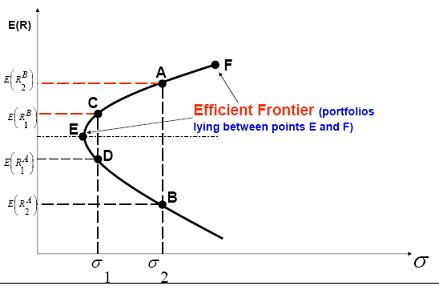

# Week 7

## Textbook: *"Chapter 5: The Trade-off between Risk and Return"*

### Risk and Return Fundamentals

How to Value a risky asset? Use **discounted cash flow (DCF) analysis**.

1. Determine the asset's expected cash flow
1. Choose a discount rate that reflects the asset's risk
1. Calculate present value.

To match a discount rate to an asset, one must know:

* how risky is the asset?
* how much return should the asset offer, given the risk?

**real return**: the increase in purchasing power that an investment provides

* If the nominal return on an investment matches inflation rate, the real return is zero

**equity risk premium**: difference between equity returns and returns on safe investments

* implies that stocks are riskier than bonds/bills

The *life-cycle mutual fund* shifts an investor's assets from stocks to bond as they age.

* Based on the strategy that stocks are less risky over the long-run and the less need you have to tap into savings, the greater wealth should be in stocks.

> Expected payoff = Expected winnings - Fee

Investors are typically *risk-averse*. This doesn't mean they won't take risk but expect to be compensated for that risk.

*Risk-neutral* investors prefer investments with higher risks and only requires a small but positive expected payoff.

*Risk-seeking* investors prefer to take risks and will invest even when expected payoff falls below that of a safer alternative.

## Basic Risk and Return Statistics

**return**: includes the change in an asset's value (either a gain or a loss) as well as any cash distribution (such as dividends or interest payments)

* P = price
* CF = cash flow
* Numerator represents the dollar return on investment from time *t* to time *t+1*. Dividing that by the initial price represents the percentage growth.

This is the measure of a return *ex post* (after the fact). The goal would be to be able to measure an asset's *ex ante* (expected) return.

**arithmetic average return**: adding up annual returns and dividing by the number of observations

* Estimate of the return that one might expect, on average, in a single period

**geometric average return**: represents the *average* compound annual return earned by an investor who bought and held the stock for four years

## Risk and Return for Portfolios

**portfolios**: combination of two or more assets by investors

* W denotes the percentage invested in that particular asset, relative to other assets in portfolio
* E(R) is the expected return.

**covariance**: measures the co-movements of two random variables

**correlation coefficient**: standardizes the covariance measure byu dividing covariance by the product of the standard deviation of each asset

* ranges from -1.0 to +1.0, the higher the number the more likely the assets move together
* Volatility of a two-asset portfolio depends on correlation between two assets. The lower their correlation coefficient, the less volatile the portfolio.
* As the number of assets in a portfolio grows, the variance has less effect on the return and the covariance has more

### Systematic Risk and Unsystematic Risk

**systematic risk**: undiversifiable or market risk; risk that no matter how diversified a portfolio becomes, it can not fall below this threshold

**unsystematic risk**: risk that diversification eliminates, also known as idiosyncratic or unique risk

## Textbook: *"Chapter 6: Risk, Return, and the Capital Asset Pricing Model"*

**minimum variance portfolio (MVP)**: the combination of assets that yields a portfolio with the lowest standard deviation

* A portfolio is *inefficient* if it it offers a lower expected return than another portfolio with the same standard deviation *(i.e. points B and D)*.
* A portfolio is considered *efficient* if it offers the highest expected return among the group of portfolios with equal or less volatility *(i.e. between E and F)*.
  * Also known as the efficient set or efficient frontier

### Risk-Free Borrowing and Lending

* In portfolios of risky and risk-free assets, the greater amount of money invested in the risky asset, the higher the expected return and volatility of the portfolio. The greater the investment in the risk-free asset the lower the expected return and volatility of portfolio.
* If investors can borrow and led at the risk-free rate, from the entire feasible set of risky portfolios, one portfolio will emerge that maximizes the return investors can expect for a given standard deviation, also known as **optimal risky portfolio**.

### Equilibrium and the Market Portfolio

**homogeneous expectations**: the expectation that investors will have similar expectations for how investments will perform in the future

* Equilibrium occurs when a market price equates the quantity demanded and supplied of a good.

**market portfolio**: the portfolio demanded by investors in equilibrium

* In theory consists of every available asset, with each asset weighted by its market value relative to the total market value of all assets.

**capital market line (CML)**: the relationship between expected return and standard deviation for portfolios consisting of the risk-free asset and the market portfolio

* This indicates that the expected return of any portfolio is equal to the risk-free rate plus a premium that depends on the portfolio's risk.
* Bracketed equation measures the risk premium on the market relative to its standard deviation, also known as **market price of risk**.

### The Capital Asset Pricing Model (CAPM)

**capital asset pricing model (CAPM)**: indicates that the expected return on a specific asset equals the risk-free rate plus a premium that depends on the asset's beta and the expected risk premium on the market portfolio

* The higher the beta of a security, the greater the security's exposure to systematic risk and the higher the expected return it must offer to investors.
* Only beta changes from one security to the next, making it a *single-factor model* where only one variable explains differences in returns across securities.

#### Challenges with CAPM

1. Makes predictions about the expected return of an asset, which is inherently unobservable.
2. CAPM is a one-period model. It can only describe the way investors form expectations on period ahead but not how they change from one period to the next.
   * There is not a unit of time specified to what "one period" is.
3. Relies on the fact of a risk-free which does not exist. Even treasury securities fluctuate.
   * Should researchers use short-term or long-term Treasury bills as a proxy for risk-free rate?
4. The use of the market portfolio is impossible to quantify so a proxy must be used which can throw off results
